# Primavera P6 Database Schema Documentation

## Overview

This document provides a comprehensive overview of the Primavera P6 Professional SQLite database schema. The database contains **125 tables** organized into logical domains for managing projects, tasks, resources, and related entities.

**Database Format**: SQLite  
**P6 Version**: Professional  
**Documentation Updated**: December 2, 2025

---

## Table of Contents

1. [Core Entities](#core-entities)
2. [Project Structure](#project-structure)
3. [Task Management](#task-management)
4. [Task Relationships](#task-relationships)
5. [Resource Management](#resource-management)
6. [Financial Management](#financial-management)
7. [Activity Codes System](#activity-codes-system)
8. [User-Defined Fields](#user-defined-fields)
9. [Risk Management](#risk-management)
10. [User & Security](#user--security)
11. [System Administration](#system-administration)
12. [Supporting Tables](#supporting-tables)
13. [Complete Table List](#complete-table-list)
14. [Implementation Notes](#implementation-notes)

---

## Core Entities

### Master Entity Relationship Diagram

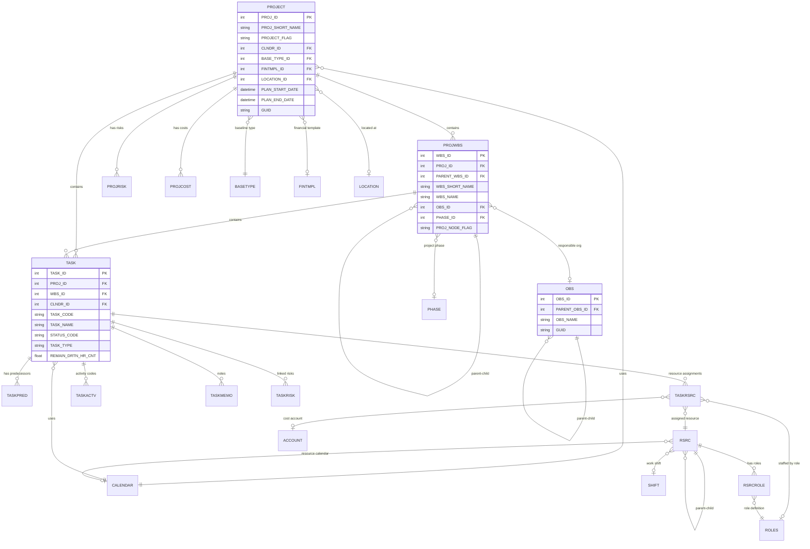

### Project Hierarchy Flow

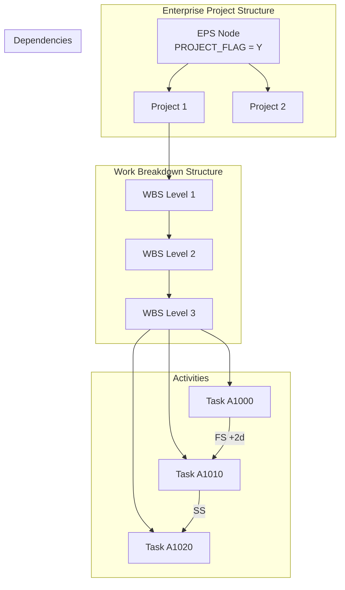

**Key Tables:**
- **PROJECT**: Main project container (EPS nodes or actual projects)
- **PROJWBS**: Work Breakdown Structure - organizes project hierarchy
- **OBS**: Organizational Breakdown Structure - organizational hierarchy
- **TASK**: Activities/tasks within projects

---

## Project Structure

### PROJECT Table (Central Hub)

The **PROJECT** table is the central entity of the database.

| Column | Type | Description |
|--------|------|-------------|
| `PROJ_ID` | INTEGER | **Primary Key** |
| `PROJ_SHORT_NAME` | TEXT(40) | Project identifier code (e.g., "PROJ001") |
| `PROJECT_FLAG` | TEXT(1) | `Y` = EPS node, `N` = Actual project |
| `CLNDR_ID` | INTEGER | FK → CALENDAR (default project calendar) |
| `BASE_TYPE_ID` | INTEGER | FK → BASETYPE (baseline type) |
| `FINTMPL_ID` | INTEGER | FK → FINTMPL (financial template) |
| `LOCATION_ID` | INTEGER | FK → LOCATION |
| `PLAN_START_DATE` | DATETIME | Planned start date |
| `PLAN_END_DATE` | DATETIME | Planned end date |
| `SCD_END_DATE` | DATETIME | Scheduled end date |
| `FCST_START_DATE` | DATETIME | Forecast start date |
| `LAST_RECALC_DATE` | DATETIME | Last schedule calculation |
| `DEF_TASK_TYPE` | TEXT(12) | Default task type for new activities |
| `DEF_DURATION_TYPE` | TEXT(12) | Default duration type |
| `DEF_COMPLETE_PCT_TYPE` | TEXT(10) | Default % complete type |
| `CRITICAL_PATH_TYPE` | TEXT(12) | Critical path calculation method |
| `CRITICAL_DRTN_HR_CNT` | REAL | Critical path threshold (hours) |
| `TASK_CODE_PREFIX` | TEXT(20) | Auto-numbering prefix |
| `TASK_CODE_BASE` | INTEGER | Auto-numbering base |
| `TASK_CODE_STEP` | INTEGER | Auto-numbering increment |
| `GUID` | TEXT(22) | Global unique identifier (base64) |
| `NAME_SEP_CHAR` | TEXT(2) | WBS path separator character |
| `ADD_DATE` | DATETIME | Project creation date |
| `ADD_BY_NAME` | TEXT(255) | Created by user |

### PROJWBS Table (Work Breakdown Structure)

| Column | Type | Description |
|--------|------|-------------|
| `WBS_ID` | INTEGER | **Primary Key** |
| `PROJ_ID` | INTEGER | FK → PROJECT |
| `PARENT_WBS_ID` | INTEGER | FK → PROJWBS (self-referential hierarchy) |
| `WBS_SHORT_NAME` | TEXT(40) | WBS code |
| `WBS_NAME` | TEXT(100) | WBS full name |
| `OBS_ID` | INTEGER | FK → OBS (responsible organization) |
| `PHASE_ID` | INTEGER | FK → PHASE (project phase) |
| `PROJ_NODE_FLAG` | TEXT(1) | `Y` = Root WBS node |
| `STATUS_CODE` | TEXT(20) | WBS status |
| `EST_WT` | REAL | Estimate weight |
| `SUM_DATA_FLAG` | TEXT(1) | Summary data indicator |
| `EV_COMPUTE_TYPE` | TEXT(20) | Earned value computation method |
| `EV_ETC_COMPUTE_TYPE` | TEXT(20) | ETC computation method |
| `ORIG_COST` | REAL | Original cost estimate |
| `INDEP_REMAIN_TOTAL_COST` | REAL | Independent remaining cost |
| `ANTICIP_START_DATE` | DATETIME | Anticipated start |
| `ANTICIP_END_DATE` | DATETIME | Anticipated end |
| `GUID` | TEXT(22) | Global unique identifier |

### Enterprise Project Structure (EPS) Diagram

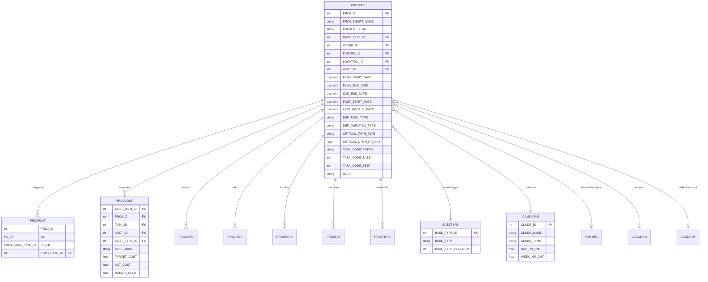

---

## Task Management

### TASK Table - Complete Schema (Critical Table)

The **TASK** table is the most important table for scheduling - it stores all activities.

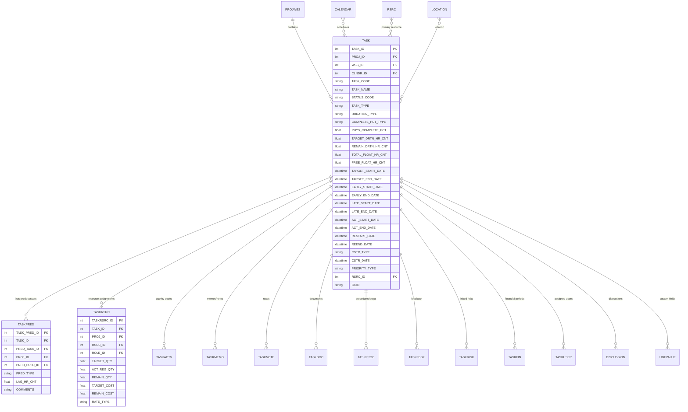

### TASK Table Column Reference

#### Identity & Classification

| Column | Type | Description |
|--------|------|-------------|
| `TASK_ID` | INTEGER | **Primary Key** |
| `PROJ_ID` | INTEGER | FK → PROJECT |
| `WBS_ID` | INTEGER | FK → PROJWBS |
| `CLNDR_ID` | INTEGER | FK → CALENDAR |
| `TASK_CODE` | TEXT(40) | Activity ID (user-visible, e.g., "A1000") |
| `TASK_NAME` | TEXT(120) | Activity name/description |
| `GUID` | TEXT(22) | Global unique identifier (base64) |
| `TMPL_GUID` | TEXT(22) | Template GUID (if created from template) |

#### Status & Progress

| Column | Type | Description |
|--------|------|-------------|
| `STATUS_CODE` | TEXT(12) | `TK_NotStart`, `TK_Active`, `TK_Complete` |
| `PHYS_COMPLETE_PCT` | REAL | Physical % complete (0.0 - 100.0) |
| `COMPLETE_PCT_TYPE` | TEXT(10) | How % complete is calculated |
| `SCP_PCT_COMPLETE` | REAL | Schedule % complete |

#### Task Classification

| Column | Type | Description |
|--------|------|-------------|
| `TASK_TYPE` | TEXT(10) | Activity type (see values below) |
| `DURATION_TYPE` | TEXT(12) | Duration calculation type |
| `PRIORITY_TYPE` | TEXT(12) | Activity priority |
| `EST_WT` | REAL | Estimate weight |

**TASK_TYPE Values:**
| Value | Description |
|-------|-------------|
| `TT_Task` | Normal Task/Activity |
| `TT_Mile` | Start Milestone |
| `TT_FinMile` | Finish Milestone |
| `TT_Rsrc` | Resource Dependent Task |
| `TT_LOE` | Level of Effort |
| `TT_WBS` | WBS Summary Activity |

**STATUS_CODE Values:**
| Value | Description |
|-------|-------------|
| `TK_NotStart` | Not Started |
| `TK_Active` | In Progress |
| `TK_Complete` | Completed |

**DURATION_TYPE Values:**
| Value | Description |
|-------|-------------|
| `DT_FixedDUR` | Fixed Duration & Units |
| `DT_FixedDUR2` | Fixed Duration & Units/Time |
| `DT_FixedUNT` | Fixed Units |
| `DT_FixedUNT2` | Fixed Units/Time |

#### Duration Fields (all in HOURS)

| Column | Type | Description |
|--------|------|-------------|
| `TARGET_DRTN_HR_CNT` | REAL | Original/baseline duration |
| `REMAIN_DRTN_HR_CNT` | REAL | Remaining duration |
| `TOTAL_FLOAT_HR_CNT` | REAL | Total float/slack |
| `FREE_FLOAT_HR_CNT` | REAL | Free float |

#### Date Fields - Planned/Target

| Column | Type | Description |
|--------|------|-------------|
| `TARGET_START_DATE` | DATETIME | Baseline/target start |
| `TARGET_END_DATE` | DATETIME | Baseline/target finish |

#### Date Fields - CPM Calculated

| Column | Type | Description |
|--------|------|-------------|
| `EARLY_START_DATE` | DATETIME | Early start (forward pass) |
| `EARLY_END_DATE` | DATETIME | Early finish (forward pass) |
| `LATE_START_DATE` | DATETIME | Late start (backward pass) |
| `LATE_END_DATE` | DATETIME | Late finish (backward pass) |
| `REM_LATE_START_DATE` | DATETIME | Remaining late start |
| `REM_LATE_END_DATE` | DATETIME | Remaining late end |

#### Date Fields - Actual

| Column | Type | Description |
|--------|------|-------------|
| `ACT_START_DATE` | DATETIME | Actual start |
| `ACT_END_DATE` | DATETIME | Actual finish |
| `RESTART_DATE` | DATETIME | Remaining start (for in-progress) |
| `REEND_DATE` | DATETIME | Remaining finish (for in-progress) |
| `SUSPEND_DATE` | DATETIME | Date activity was suspended |
| `RESUME_DATE` | DATETIME | Date activity was resumed |
| `EXPECT_END_DATE` | DATETIME | Expected finish date |

#### Constraint Fields

| Column | Type | Description |
|--------|------|-------------|
| `CSTR_TYPE` | TEXT(12) | Primary constraint type |
| `CSTR_DATE` | DATETIME | Primary constraint date |
| `CSTR_TYPE2` | TEXT(12) | Secondary constraint type |
| `CSTR_DATE2` | DATETIME | Secondary constraint date |

**Constraint Type Values:**
| Value | Description |
|-------|-------------|
| `CS_ALAP` | As Late As Possible |
| `CS_MEO` | Finish On |
| `CS_MEOA` | Finish On or After |
| `CS_MEOB` | Finish On or Before |
| `CS_MSO` | Start On |
| `CS_MSOA` | Start On or After (most common) |
| `CS_MSOB` | Start On or Before |
| `CS_MANDSTART` | Mandatory Start |
| `CS_MANDFIN` | Mandatory Finish |

#### Work Quantity Fields

| Column | Type | Description |
|--------|------|-------------|
| `TARGET_WORK_QTY` | REAL | Budgeted labor work quantity |
| `ACT_WORK_QTY` | REAL | Actual labor work quantity |
| `REMAIN_WORK_QTY` | REAL | Remaining labor work |
| `TARGET_EQUIP_QTY` | REAL | Budgeted equipment quantity |
| `ACT_EQUIP_QTY` | REAL | Actual equipment quantity |
| `REMAIN_EQUIP_QTY` | REAL | Remaining equipment |
| `ACT_THIS_PER_WORK_QTY` | REAL | Actual work this period |
| `ACT_THIS_PER_EQUIP_QTY` | REAL | Actual equipment this period |

#### Critical Path Fields

| Column | Type | Description |
|--------|------|-------------|
| `FLOAT_PATH` | INTEGER | Float path identifier |
| `FLOAT_PATH_ORDER` | INTEGER | Order within float path |
| `DRIVING_PATH_FLAG` | TEXT(1) | `Y` = On driving/critical path |

#### External Dependencies

| Column | Type | Description |
|--------|------|-------------|
| `EXTERNAL_EARLY_START_DATE` | DATETIME | External predecessor constraint |
| `EXTERNAL_LATE_END_DATE` | DATETIME | External successor constraint |

#### Resource & Location

| Column | Type | Description |
|--------|------|-------------|
| `RSRC_ID` | INTEGER | FK → RSRC (primary resource) |
| `LOCATION_ID` | INTEGER | FK → LOCATION |

#### Control Flags

| Column | Type | Description |
|--------|------|-------------|
| `REV_FDBK_FLAG` | TEXT(1) | Review feedback required |
| `LOCK_PLAN_FLAG` | TEXT(1) | Plan dates locked |
| `AUTO_COMPUTE_ACT_FLAG` | TEXT(1) | Auto-compute actuals |
| `CONTROL_UPDATES_FLAG` | TEXT(1) | Control updates enabled |

---

## Task Relationships

### TASKPRED Table (Dependencies/Logic Ties)

The **TASKPRED** table defines activity relationships. **Critical:** `TASK_ID` is the **successor**, `PRED_TASK_ID` is the **predecessor**.

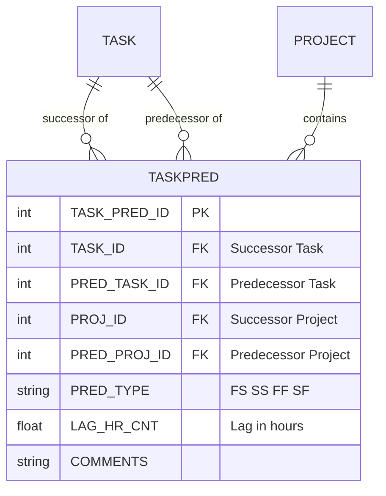

### TASKPRED Column Reference

| Column | Type | Description |
|--------|------|-------------|
| `TASK_PRED_ID` | INTEGER | **Primary Key** |
| `TASK_ID` | INTEGER | FK → TASK (**Successor** activity) |
| `PRED_TASK_ID` | INTEGER | FK → TASK (**Predecessor** activity) |
| `PROJ_ID` | INTEGER | FK → PROJECT (successor's project) |
| `PRED_PROJ_ID` | INTEGER | FK → PROJECT (predecessor's project - for external links) |
| `PRED_TYPE` | TEXT(12) | Relationship type |
| `LAG_HR_CNT` | REAL | Lag time in **hours** (negative = lead) |
| `COMMENTS` | TEXT(250) | Relationship notes |

### Relationship Types (PRED_TYPE)

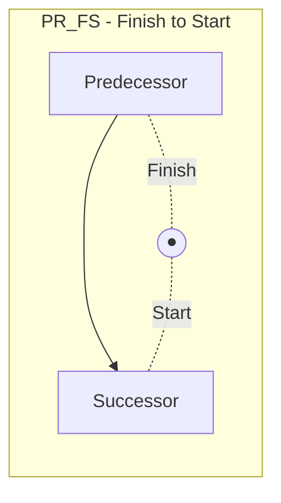

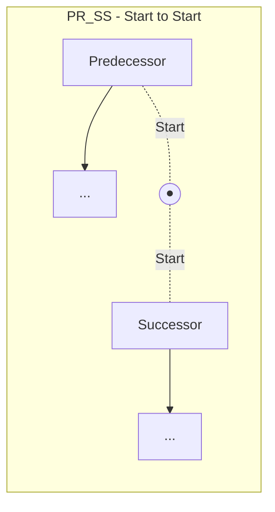

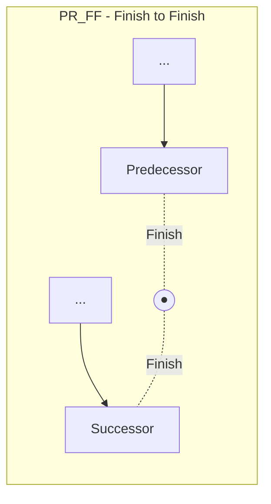

| Value | Description | Usage |
|-------|-------------|-------|
| `PR_FS` | Finish-to-Start | Most common (90%+). Successor starts after predecessor finishes |
| `PR_SS` | Start-to-Start | Activities start together (with optional lag) |
| `PR_FF` | Finish-to-Finish | Activities finish together (with optional lag) |
| `PR_SF` | Start-to-Finish | Rare. Successor finishes when predecessor starts |

### Relationship Direction Diagram

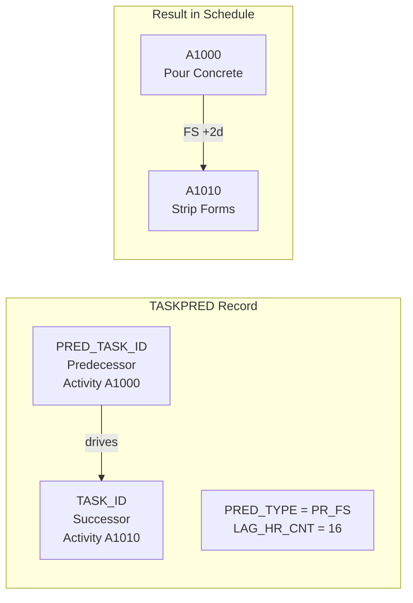

---

## Resource Management

### Resources and Assignments

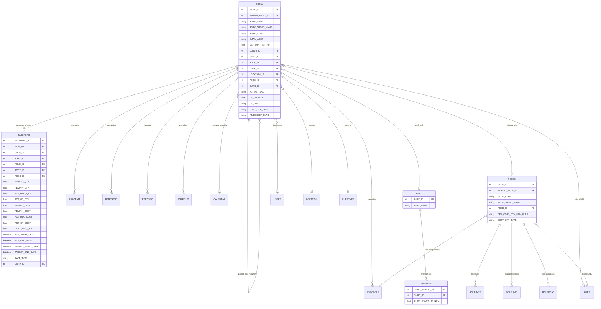

### RSRC Table (Resource Master)

| Column | Type | Description |
|--------|------|-------------|
| `RSRC_ID` | INTEGER | **Primary Key** |
| `PARENT_RSRC_ID` | INTEGER | FK → RSRC (hierarchical resources) |
| `RSRC_NAME` | TEXT(255) | Full resource name |
| `RSRC_SHORT_NAME` | TEXT(255) | Resource ID/code |
| `RSRC_TYPE` | TEXT(10) | Resource type (see values below) |
| `RSRC_TITLE_NAME` | TEXT(100) | Job title |
| `EMAIL_ADDR` | TEXT(120) | Email address |
| `EMPLOYEE_CODE` | TEXT(40) | Employee ID |
| `OFFICE_PHONE` | TEXT(32) | Office phone |
| `OTHER_PHONE` | TEXT(32) | Other phone |
| `DEF_QTY_PER_HR` | REAL | Default units per hour (max availability) |
| `CLNDR_ID` | INTEGER | FK → CALENDAR (resource calendar) |
| `SHIFT_ID` | INTEGER | FK → SHIFT |
| `ROLE_ID` | INTEGER | FK → ROLES (primary role) |
| `USER_ID` | INTEGER | FK → USERS (if linked to P6 user) |
| `LOCATION_ID` | INTEGER | FK → LOCATION |
| `POBS_ID` | INTEGER | FK → POBS (project OBS) |
| `CURR_ID` | INTEGER | FK → CURRTYPE (currency) |
| `UNIT_ID` | INTEGER | FK → UMEASURE (unit of measure) |
| `ACTIVE_FLAG` | TEXT(1) | `Y` = Active, `N` = Inactive |
| `OT_FACTOR` | REAL | Overtime cost multiplier |
| `OT_FLAG` | TEXT(1) | `Y` = Overtime capable |
| `AUTO_COMPUTE_ACT_FLAG` | TEXT(1) | Auto-compute actuals |
| `DEF_COST_QTY_LINK_FLAG` | TEXT(1) | Link cost to quantity |
| `COST_QTY_TYPE` | TEXT(24) | Cost/quantity relationship type |
| `TIMESHEET_FLAG` | TEXT(1) | `Y` = Timesheet resource |
| `GUID` | TEXT(22) | Global unique identifier |
| `RSRC_NOTES` | BLOB | Resource notes (RTF) |

### Resource Types (RSRC_TYPE)

| Value | Description | Example |
|-------|-------------|---------|
| `RT_Labor` | Labor/People | Engineers, Operators |
| `RT_Mat` | Material | Concrete, Steel |
| `RT_Equip` | Equipment | Cranes, Excavators |
| `RT_Nonlabor` | Non-labor | Subcontracts, Services |

### TASKRSRC Table (Resource Assignments)

| Column | Type | Description |
|--------|------|-------------|
| `TASKRSRC_ID` | INTEGER | **Primary Key** |
| `TASK_ID` | INTEGER | FK → TASK |
| `PROJ_ID` | INTEGER | FK → PROJECT |
| `RSRC_ID` | INTEGER | FK → RSRC (can be null if role-staffed) |
| `ROLE_ID` | INTEGER | FK → ROLES (if staffed by role) |
| `ACCT_ID` | INTEGER | FK → ACCOUNT (cost account) |
| `POBS_ID` | INTEGER | FK → POBS |
| `SKILL_LEVEL` | INTEGER | Required skill level |
| **Quantity Fields** | | |
| `TARGET_QTY` | REAL | Budgeted quantity (units) |
| `REMAIN_QTY` | REAL | Remaining quantity |
| `ACT_REG_QTY` | REAL | Actual regular time |
| `ACT_OT_QTY` | REAL | Actual overtime |
| `TARGET_QTY_PER_HR` | REAL | Planned units/hour |
| `REMAIN_QTY_PER_HR` | REAL | Remaining units/hour |
| **Cost Fields** | | |
| `TARGET_COST` | REAL | Budgeted cost |
| `REMAIN_COST` | REAL | Remaining cost |
| `ACT_REG_COST` | REAL | Actual regular cost |
| `ACT_OT_COST` | REAL | Actual overtime cost |
| `COST_PER_QTY` | REAL | Rate/price |
| `ACT_THIS_PER_COST` | REAL | Actual cost this period |
| `ACT_THIS_PER_QTY` | REAL | Actual quantity this period |
| **Date Fields** | | |
| `ACT_START_DATE` | DATETIME | Assignment actual start |
| `ACT_END_DATE` | DATETIME | Assignment actual finish |
| `TARGET_START_DATE` | DATETIME | Assignment planned start |
| `TARGET_END_DATE` | DATETIME | Assignment planned finish |
| `RESTART_DATE` | DATETIME | Remaining start |
| `REEND_DATE` | DATETIME | Remaining finish |
| `REM_LATE_START_DATE` | DATETIME | Late start (remaining) |
| `REM_LATE_END_DATE` | DATETIME | Late end (remaining) |
| **Lag Fields** | | |
| `TARGET_LAG_DRTN_HR_CNT` | REAL | Planned lag from activity |
| `RELAG_DRTN_HR_CNT` | REAL | Remaining lag |
| **Curve Fields** | | |
| `CURV_ID` | INTEGER | FK → RSRCCURV (resource curve) |
| `TARGET_CRV` | TEXT(4000) | Custom target curve data |
| `REMAIN_CRV` | TEXT(4000) | Custom remaining curve data |
| `ACTUAL_CRV` | TEXT(4000) | Custom actual curve data |
| **Other** | | |
| `RATE_TYPE` | TEXT(14) | Rate type used |
| `RSRC_TYPE` | TEXT(10) | Resource type (denormalized) |
| `COST_QTY_LINK_FLAG` | TEXT(1) | Link cost to quantity |
| `ROLLUP_DATES_FLAG` | TEXT(1) | Roll up dates to activity |
| `OT_FACTOR` | REAL | Overtime multiplier |
| `COST_PER_QTY_SOURCE_TYPE` | TEXT(24) | Source of rate |
| `GUID` | TEXT(22) | Global unique identifier |

### RSRCRATE Table (Resource Cost Rates)

| Column | Type | Description |
|--------|------|-------------|
| `RSRC_RATE_ID` | INTEGER | **Primary Key** |
| `RSRC_ID` | INTEGER | FK → RSRC |
| `START_DATE` | DATETIME | Effective date |
| `MAX_QTY_PER_HR` | REAL | Maximum availability |
| `COST_PER_QTY` | REAL | Standard rate |
| `COST_PER_QTY2` | REAL | Rate 2 |
| `COST_PER_QTY3` | REAL | Rate 3 |
| `COST_PER_QTY4` | REAL | Rate 4 |
| `COST_PER_QTY5` | REAL | Rate 5 |
| `SHIFT_PERIOD_ID` | INTEGER | FK → SHIFTPER |

### RSRCCURV Table (Resource Curves)

| Column | Type | Description |
|--------|------|-------------|
| `CURV_ID` | INTEGER | **Primary Key** |
| `CURV_NAME` | TEXT(60) | Curve name |
| `DEFAULT_FLAG` | TEXT(1) | Is default curve |
| `CURV_DATA` | BLOB | Curve distribution data |

---

## Financial Management

### Cost Accounts and Budgets

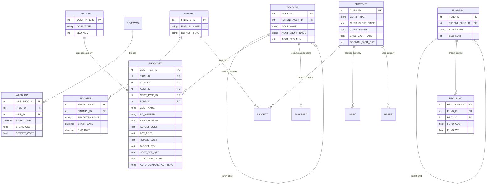

### ACCOUNT Table (Cost Account Structure)

| Column | Type | Description |
|--------|------|-------------|
| `ACCT_ID` | INTEGER | **Primary Key** |
| `PARENT_ACCT_ID` | INTEGER | FK → ACCOUNT (hierarchical) |
| `ACCT_NAME` | TEXT(100) | Account name |
| `ACCT_SHORT_NAME` | TEXT(40) | Account code |
| `ACCT_SEQ_NUM` | INTEGER | Display sequence |
| `ACCT_DESCR` | BLOB | Description (RTF) |

### PROJCOST Table (Project Expenses)

| Column | Type | Description |
|--------|------|-------------|
| `COST_ITEM_ID` | INTEGER | **Primary Key** |
| `PROJ_ID` | INTEGER | FK → PROJECT |
| `TASK_ID` | INTEGER | FK → TASK (if task-level expense) |
| `ACCT_ID` | INTEGER | FK → ACCOUNT |
| `COST_TYPE_ID` | INTEGER | FK → COSTTYPE |
| `POBS_ID` | INTEGER | FK → POBS |
| `COST_NAME` | TEXT(120) | Expense name |
| `PO_NUMBER` | TEXT(32) | Purchase order number |
| `VENDOR_NAME` | TEXT(100) | Vendor name |
| `TARGET_COST` | REAL | Budgeted cost |
| `ACT_COST` | REAL | Actual cost |
| `REMAIN_COST` | REAL | Remaining cost |
| `TARGET_QTY` | REAL | Budgeted quantity |
| `COST_PER_QTY` | REAL | Unit cost |
| `QTY_NAME` | TEXT(30) | Quantity unit name |
| `COST_LOAD_TYPE` | TEXT(12) | How costs are spread |
| `AUTO_COMPUTE_ACT_FLAG` | TEXT(1) | Auto-calculate actuals |
| `COST_DESCR` | BLOB | Description (RTF) |

### WBSBUDG Table (WBS-Level Budgets)

| Column | Type | Description |
|--------|------|-------------|
| `WBS_BUDG_ID` | INTEGER | **Primary Key** |
| `PROJ_ID` | INTEGER | FK → PROJECT |
| `WBS_ID` | INTEGER | FK → PROJWBS |
| `START_DATE` | DATETIME | Budget period start |
| `SPEND_COST` | REAL | Spend budget |
| `BENEFIT_COST` | REAL | Benefit budget |

### Financial Period Integration

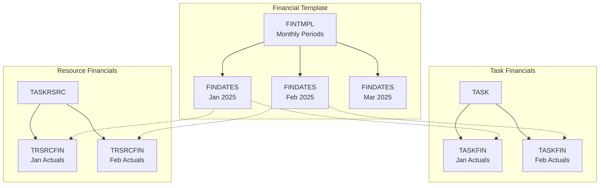

---

## Activity Codes System

### Activity Code Structure

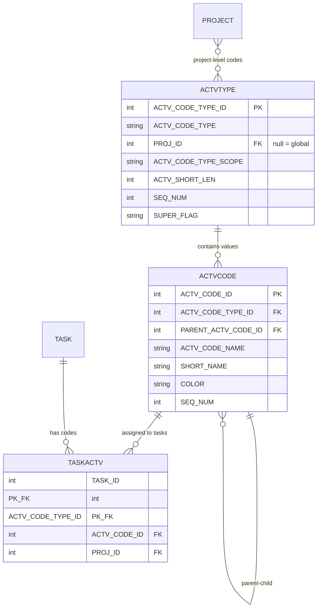

### ACTVTYPE Table (Activity Code Types)

| Column | Type | Description |
|--------|------|-------------|
| `ACTV_CODE_TYPE_ID` | INTEGER | **Primary Key** |
| `ACTV_CODE_TYPE` | TEXT(40) | Code type name (e.g., "Phase", "Area") |
| `PROJ_ID` | INTEGER | FK → PROJECT (null = global code) |
| `ACTV_CODE_TYPE_SCOPE` | TEXT(10) | `Global`, `EPS`, `Project` |
| `ACTV_SHORT_LEN` | INTEGER | Max short name length |
| `SEQ_NUM` | INTEGER | Display sequence |
| `SUPER_FLAG` | TEXT(1) | Secure code type |

### ACTVCODE Table (Activity Code Values)

| Column | Type | Description |
|--------|------|-------------|
| `ACTV_CODE_ID` | INTEGER | **Primary Key** |
| `ACTV_CODE_TYPE_ID` | INTEGER | FK → ACTVTYPE |
| `PARENT_ACTV_CODE_ID` | INTEGER | FK → ACTVCODE (hierarchical) |
| `ACTV_CODE_NAME` | TEXT(120) | Code value name |
| `SHORT_NAME` | TEXT(60) | Code short name |
| `COLOR` | TEXT(6) | Display color (hex RGB) |
| `SEQ_NUM` | INTEGER | Display sequence |

### TASKACTV Table (Task Code Assignments)

| Column | Type | Description |
|--------|------|-------------|
| `TASK_ID` | INTEGER | **PK** → TASK |
| `ACTV_CODE_TYPE_ID` | INTEGER | **PK** → ACTVTYPE |
| `ACTV_CODE_ID` | INTEGER | FK → ACTVCODE |
| `PROJ_ID` | INTEGER | FK → PROJECT |

### Activity Code Example

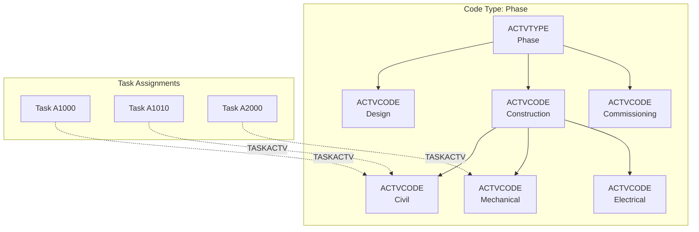

---

## User-Defined Fields

### UDF System Structure

```mermaid
erDiagram
    UDFTYPE ||--o{ UDFVALUE : "stores values"
    UDFTYPE ||--o{ UDFCODE : "code list options"
    
    UDFTYPE {
        int UDF_TYPE_ID PK
        string TABLE_NAME "TASK PROJECT PROJWBS etc"
        string UDF_TYPE_NAME
        string UDF_TYPE_LABEL
        string LOGICAL_DATA_TYPE
        string SUPER_FLAG
        string FORMULA
        string INDICATOR_EXPRESSION
        string SUMMARY_INDICATOR_EXPRESSION
    }
    
    UDFVALUE {
        int UDF_TYPE_ID PK_FK
        int FK_ID PK "ID from target table"
        int PROJ_ID FK
        string TABLE_NAME
        string UDF_TEXT
        float UDF_NUMBER
        datetime UDF_DATE
        int UDF_CODE_ID FK
    }
    
    UDFCODE {
        int UDF_CODE_ID PK
        int UDF_TYPE_ID FK
        string UDF_CODE_NAME
        string SHORT_NAME
    }
```

### UDFTYPE Table (UDF Definitions)

| Column | Type | Description |
|--------|------|-------------|
| `UDF_TYPE_ID` | INTEGER | **Primary Key** |
| `TABLE_NAME` | TEXT(30) | Target table: `TASK`, `PROJECT`, `PROJWBS`, `RSRC`, `TASKRSRC` |
| `UDF_TYPE_NAME` | TEXT(32) | Field internal name |
| `UDF_TYPE_LABEL` | TEXT(40) | Field display label |
| `LOGICAL_DATA_TYPE` | TEXT(20) | Data type (see below) |
| `SUPER_FLAG` | TEXT(1) | Secure field |
| `FORMULA` | TEXT(4000) | Formula for calculated fields |
| `INDICATOR_EXPRESSION` | TEXT(4000) | Visual indicator expression |
| `SUMMARY_INDICATOR_EXPRESSION` | TEXT(4000) | Summary visual indicator |

**LOGICAL_DATA_TYPE Values:**
| Value | Description |
|-------|-------------|
| `FT_TEXT` | Text field |
| `FT_FLOAT` | Number (decimal) |
| `FT_INT` | Integer |
| `FT_START_DATE` | Start date |
| `FT_END_DATE` | End date |
| `FT_COST` | Cost value |
| `FT_INDICATOR` | Visual indicator |
| `FT_CODE` | Code list |

### UDFVALUE Table (UDF Values)

| Column | Type | Description |
|--------|------|-------------|
| `UDF_TYPE_ID` | INTEGER | **PK** → UDFTYPE |
| `FK_ID` | INTEGER | **PK** - ID from target table (e.g., TASK_ID) |
| `PROJ_ID` | INTEGER | FK → PROJECT |
| `TABLE_NAME` | TEXT(30) | Target table name |
| `UDF_TEXT` | TEXT(255) | Text value |
| `UDF_NUMBER` | REAL | Numeric value |
| `UDF_DATE` | DATETIME | Date value |
| `UDF_CODE_ID` | INTEGER | FK → UDFCODE (if code list type) |

### UDFCODE Table (Code List Values)

| Column | Type | Description |
|--------|------|-------------|
| `UDF_CODE_ID` | INTEGER | **Primary Key** |
| `UDF_TYPE_ID` | INTEGER | FK → UDFTYPE |
| `UDF_CODE_NAME` | TEXT(120) | Code value display name |
| `SHORT_NAME` | TEXT(60) | Code value short name |

---

## Risk Management

### Risk System Structure

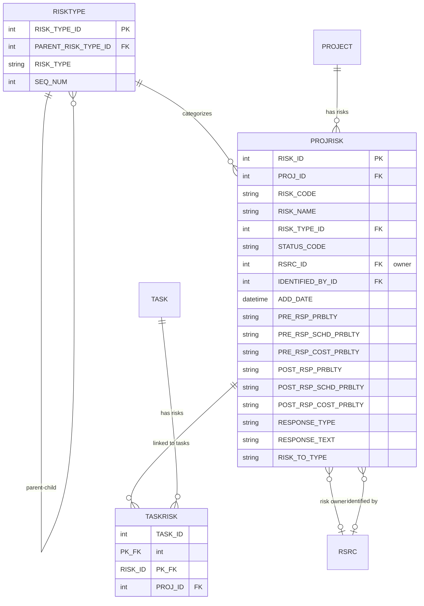

### PROJRISK Table (Project Risks)

| Column | Type | Description |
|--------|------|-------------|
| `RISK_ID` | INTEGER | **Primary Key** |
| `PROJ_ID` | INTEGER | FK → PROJECT |
| `RISK_CODE` | TEXT(40) | Risk ID/code |
| `RISK_NAME` | TEXT(200) | Risk title |
| `RISK_TYPE_ID` | INTEGER | FK → RISKTYPE (category) |
| `STATUS_CODE` | TEXT(12) | Risk status |
| `RSRC_ID` | INTEGER | FK → RSRC (risk owner) |
| `IDENTIFIED_BY_ID` | INTEGER | FK → RSRC (who identified) |
| `ADD_DATE` | DATETIME | Date identified |
| **Probability Fields** | | |
| `PRE_RSP_PRBLTY` | TEXT(2) | Pre-response probability |
| `PRE_RSP_SCHD_PRBLTY` | TEXT(2) | Pre-response schedule probability |
| `PRE_RSP_COST_PRBLTY` | TEXT(2) | Pre-response cost probability |
| `POST_RSP_PRBLTY` | TEXT(2) | Post-response probability |
| `POST_RSP_SCHD_PRBLTY` | TEXT(2) | Post-response schedule probability |
| `POST_RSP_COST_PRBLTY` | TEXT(2) | Post-response cost probability |
| **Response Fields** | | |
| `RESPONSE_TYPE` | TEXT(12) | Response strategy |
| `RESPONSE_TEXT` | TEXT(255) | Response description |
| `RISK_TO_TYPE` | TEXT(12) | Risk exposure type |
| **Description Fields** | | |
| `RISK_DESC` | TEXT(4000) | Risk description |
| `RISK_CAUSE` | TEXT(4000) | Risk cause |
| `RISK_EFFECT` | TEXT(4000) | Risk effect |
| `NOTES` | TEXT(4000) | Additional notes |
| `RISK_DESCR` | BLOB | Rich text description |

---

## User & Security

### Users and Access Control

```mermaid
erDiagram
    USERS ||--o{ USEROBS : "OBS access"
    USERS ||--o{ USESSION : "sessions"
    USERS ||--o{ USERSET : "settings"
    USERS ||--o{ USERDATA : "user data"
    USERS ||--o{ USERENG : "db engines"
    USERS }o--|| PROFILE : "security profile"
    USERS }o--o| CURRTYPE : "currency preference"
    
    PROFILE ||--o{ PROFPRIV : "privileges"
    PROFILE ||--o{ USEROBS : "OBS profiles"
    
    OBS ||--o{ USEROBS : "user assignments"
    
    PROJSHAR ||--o{ PROJECT : "shared projects"
    PROJSHAR }o--|| USESSION : "session access"
    
    RSRCSEC }o--|| USERS : "resource access"
    RSRCSEC }o--|| RSRC : "accessible resources"
    
    USERS {
        int USER_ID PK
        string USER_NAME
        string ACTUAL_NAME
        string EMAIL_ADDR
        int PROF_ID FK
        int CURR_ID FK
        string PASSWD
        string GUID
        string GLOBAL_FLAG
        string ALL_RSRC_ACCESS_FLAG
        string EMAIL_TYPE
        string OFFICE_PHONE
    }
    
    PROFILE {
        int PROF_ID PK
        string PROF_NAME
        string DEFAULT_FLAG
        string SUPERUSER_FLAG
        string SCOPE_TYPE
    }
    
    PROFPRIV {
        int PROF_ID PK_FK
        int PRIV_NUM PK
        string ALLOW_FLAG
    }
    
    USEROBS {
        int USER_ID PK_FK
        int OBS_ID PK_FK
        int PROF_ID FK
    }
    
    USESSION {
        int SESSION_ID PK
        int USER_ID FK
        datetime LOGIN_TIME
        datetime LAST_ACTIVE_TIME
        string HOST_NAME
        string APP_NAME
        string DB_ENGINE_TYPE
        string OS_USER_NAME
        int PROCESS_NUM
    }
    
    PROJSHAR {
        int PROJ_ID PK_FK
        int SESSION_ID PK_FK
        int ACCESS_LEVEL
        string LOAD_STATUS
    }
```

### USERS Table

| Column | Type | Description |
|--------|------|-------------|
| `USER_ID` | INTEGER | **Primary Key** |
| `USER_NAME` | TEXT(255) | Login username |
| `ACTUAL_NAME` | TEXT(255) | Full display name |
| `EMAIL_ADDR` | TEXT(120) | Email address |
| `PROF_ID` | INTEGER | FK → PROFILE (security profile) |
| `CURR_ID` | INTEGER | FK → CURRTYPE (currency preference) |
| `PASSWD` | TEXT(255) | Password (encrypted) |
| `GUID` | TEXT(22) | Global unique identifier |
| `GLOBAL_FLAG` | TEXT(1) | Global or module-specific user |
| `ALL_RSRC_ACCESS_FLAG` | TEXT(1) | `Y` = Access all resources |
| `EMAIL_TYPE` | TEXT(16) | Email protocol type |
| `EMAIL_SEND_SERVER` | TEXT(120) | SMTP server |
| `EMAIL_SRV_USER_NAME` | TEXT(32) | Email username |
| `EMAIL_SRV_PASSWD` | TEXT(255) | Email password |
| `OFFICE_PHONE` | TEXT(32) | Office phone |
| `CR_EXTERNAL_KEY` | TEXT(4000) | External system key |

### PROFILE Table (Security Profiles)

| Column | Type | Description |
|--------|------|-------------|
| `PROF_ID` | INTEGER | **Primary Key** |
| `PROF_NAME` | TEXT(100) | Profile name |
| `DEFAULT_FLAG` | TEXT(1) | Default profile |
| `SUPERUSER_FLAG` | TEXT(1) | `Y` = Admin profile |
| `SCOPE_TYPE` | TEXT(12) | `Global` or `Project` |

### PROFPRIV Table (Profile Privileges)

| Column | Type | Description |
|--------|------|-------------|
| `PROF_ID` | INTEGER | **PK** → PROFILE |
| `PRIV_NUM` | INTEGER | **PK** - Privilege number |
| `ALLOW_FLAG` | TEXT(1) | `Y` = Allowed |

### USEROBS Table (User OBS Access)

| Column | Type | Description |
|--------|------|-------------|
| `USER_ID` | INTEGER | **PK** → USERS |
| `OBS_ID` | INTEGER | **PK** → OBS |
| `PROF_ID` | INTEGER | FK → PROFILE (profile for this OBS) |

### Security Model Diagram

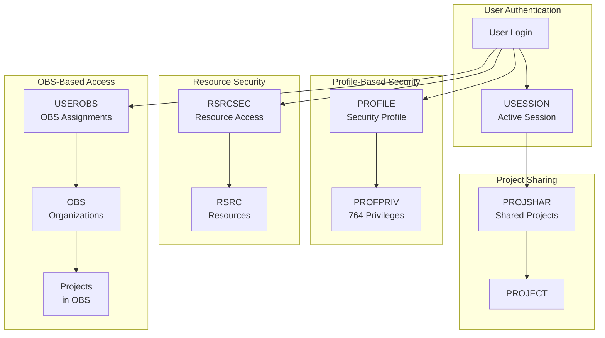

---

## System Administration

### ID Generation (NEXTKEY Table)

The **NEXTKEY** table manages auto-increment IDs for all primary keys in the database.

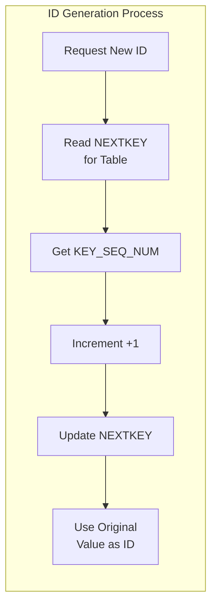

| Column | Type | Description |
|--------|------|-------------|
| `KEY_NAME` | TEXT(30) | **Primary Key** - Table name |
| `KEY_SEQ_NUM` | INTEGER | Next available ID |

**Example NEXTKEY Entries:**
```
KEY_NAME        KEY_SEQ_NUM
TASK            1001
TASKPRED        501
TASKRSRC        301
PROJECT         3
PROJWBS         5
RSRC            101
```

### BASETYPE Table (Baseline Types)

| Column | Type | Description |
|--------|------|-------------|
| `BASE_TYPE_ID` | INTEGER | **Primary Key** |
| `BASE_TYPE` | TEXT(40) | Baseline type name |
| `BASE_TYPE_SEQ_NUM` | INTEGER | Display sequence |

**Pre-populated Values:**
- Project Baseline
- Primary Baseline (Baseline 1)
- Secondary Baseline (Baseline 2)
- Tertiary Baseline (Baseline 3)
- What-If Baseline
- Initial Baseline

### CALENDAR Table

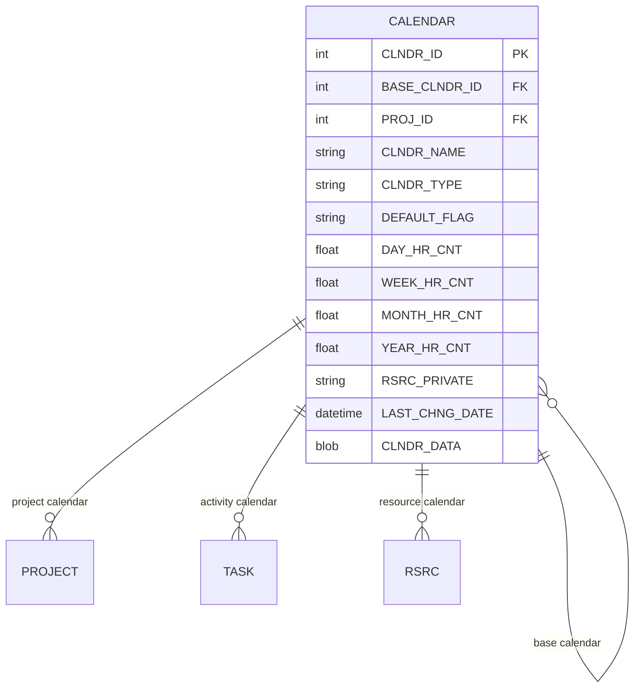

| Column | Type | Description |
|--------|------|-------------|
| `CLNDR_ID` | INTEGER | **Primary Key** |
| `BASE_CLNDR_ID` | INTEGER | FK → CALENDAR (parent/base calendar) |
| `PROJ_ID` | INTEGER | FK → PROJECT (if project-specific) |
| `CLNDR_NAME` | TEXT(255) | Calendar name |
| `CLNDR_TYPE` | TEXT(16) | Calendar type |
| `DEFAULT_FLAG` | TEXT(1) | `Y` = Default calendar |
| `DAY_HR_CNT` | REAL | Hours per day |
| `WEEK_HR_CNT` | REAL | Hours per week |
| `MONTH_HR_CNT` | REAL | Hours per month |
| `YEAR_HR_CNT` | REAL | Hours per year |
| `RSRC_PRIVATE` | TEXT(1) | Resource-private calendar |
| `CLNDR_DATA` | BLOB | Work patterns & exceptions |
| `LAST_CHNG_DATE` | DATETIME | Last modification |

### OBS Table (Organizational Breakdown Structure)

| Column | Type | Description |
|--------|------|-------------|
| `OBS_ID` | INTEGER | **Primary Key** |
| `PARENT_OBS_ID` | INTEGER | FK → OBS (self-referential) |
| `OBS_NAME` | TEXT(100) | Organization name |
| `OBS_DESCR` | BLOB | Description (RTF) |
| `SEQ_NUM` | INTEGER | Display sequence |
| `GUID` | TEXT(22) | Global unique identifier |

### PREFER Table (Global Preferences)

Single-row table storing global database settings.

| Column | Type | Description |
|--------|------|-------------|
| `PREFER_ID` | INTEGER | **Primary Key** (always 1) |
| `DAY_HR_CNT` | REAL | Default hours/day |
| `WEEK_HR_CNT` | REAL | Default hours/week |
| `MONTH_HR_CNT` | REAL | Default hours/month |
| `YEAR_HR_CNT` | REAL | Default hours/year |
| `MAX_WBS_LEVEL_CNT` | INTEGER | Maximum WBS levels |
| `MAX_RSRC_LEVEL_CNT` | INTEGER | Maximum resource levels |
| `MAX_OBS_LEVEL_CNT` | INTEGER | Maximum OBS levels |
| `DEF_TARGET_DRTN_HR_CNT` | REAL | Default activity duration |
| `DATABASE_VERSION` | TEXT(30) | P6 database version |
| `NAME_SEP_CHAR` | TEXT(2) | WBS path separator |
| `CURR_ID` | INTEGER | FK → CURRTYPE (default currency) |

### SETTINGS Table (Application Settings)

| Column | Type | Description |
|--------|------|-------------|
| `NAMESPACE` | TEXT(255) | **PK** - Settings category |
| `SETTING_NAME` | TEXT(255) | **PK** - Setting name |
| `SETTING_VALUE` | TEXT(4000) | Setting value |
| `USER_ID` | INTEGER | FK → USERS (if user-specific) |

---

## Supporting Tables

### Calendars

```mermaid
erDiagram
    CALENDAR ||--o{ PROJECT : "project calendar"
    CALENDAR ||--o{ TASK : "activity calendar"
    CALENDAR ||--o{ RSRC : "resource calendar"
    CALENDAR ||--o{ CALENDAR : "base calendar"
    
    CALENDAR {
        int CLNDR_ID PK
        int BASE_CLNDR_ID FK
        int PROJ_ID FK
        string CLNDR_NAME
        string CLNDR_TYPE
        string DEFAULT_FLAG
        float DAY_HR_CNT
        float WEEK_HR_CNT
        float MONTH_HR_CNT
        float YEAR_HR_CNT
        blob CLNDR_DATA
    }
```

### Memos, Notes & Documents

```mermaid
erDiagram
    MEMOTYPE ||--o{ TASKMEMO : "task memos"
    MEMOTYPE ||--o{ WBSMEMO : "WBS memos"
    
    TASK ||--o{ TASKMEMO : "has memos"
    TASK ||--o{ TASKNOTE : "has notes"
    TASK ||--o{ TASKDOC : "has documents"
    TASK ||--o{ DISCUSSION : "has discussions"
    
    PROJWBS ||--o{ WBSMEMO : "has memos"
    
    DOCUMENT ||--o{ DOCUMENT : "parent-child"
    DOCUMENT ||--o{ TASKDOC : "linked to tasks"
    DOCUMENT }o--o| DOCSTAT : "status"
    DOCUMENT }o--o| DOCCATG : "category"
    
    DISCUSSION ||--o{ DISCUSSION_READ : "read status"
    DISCUSSION }o--|| USERS : "posted by"
    
    MEMOTYPE {
        int MEMO_TYPE_ID PK
        string MEMO_TYPE
        string EPS_FLAG
        string PROJ_FLAG
        string WBS_FLAG
        string TASK_FLAG
        int SEQ_NUM
    }
    
    TASKMEMO {
        int MEMO_ID PK
        int TASK_ID FK
        int MEMO_TYPE_ID FK
        int PROJ_ID FK
        blob TASK_MEMO
    }
    
    TASKNOTE {
        int TASK_ID PK_FK
        int PROJ_ID FK
        blob TASK_NOTES
    }
    
    DOCUMENT {
        int DOC_ID PK
        int PARENT_DOC_ID FK
        int PROJ_ID FK
        int DOC_STATUS_ID FK
        int DOC_CATG_ID FK
        string DOC_NAME
        string DOC_SHORT_NAME
        string VERSION_NAME
        datetime DOC_DATE
        string AUTHOR_NAME
        string PRIVATE_LOC
        string PUBLIC_LOC
        blob DOC_CONTENT
    }
    
    TASKDOC {
        int TASKDOC_ID PK
        int TASK_ID FK
        int DOC_ID FK
        int PROJ_ID FK
        int WBS_ID FK
        string WP_FLAG
    }
    
    DISCUSSION {
        int DISCUSSION_ID PK
        int TASK_ID FK
        int USER_ID FK
        string DISCUSSION_VALUE
        datetime DISCUSSION_DATE
    }
```

### Procedures/Steps

```mermaid
erDiagram
    PROCGROUP ||--o{ PROCITEM : "contains steps"
    TASK ||--o{ TASKPROC : "has procedures"
    
    PROCGROUP {
        int PROC_GROUP_ID PK
        string PROC_GROUP_NAME
        int SEQ_NUM
    }
    
    PROCITEM {
        int PROC_ITEM_ID PK
        int PROC_GROUP_ID FK
        string PROC_NAME
        float PROC_WT
        int SEQ_NUM
        blob PROC_DESCR
    }
    
    TASKPROC {
        int PROC_ID PK
        int TASK_ID FK
        int PROJ_ID FK
        string PROC_NAME
        float PROC_WT
        float COMPLETE_PCT
        string COMPLETE_FLAG
        int SEQ_NUM
        blob PROC_DESCR
    }
```

### Issues

```mermaid
erDiagram
    PROJECT ||--o{ PROJISSU : "has issues"
    PROJISSU ||--o{ ISSUHIST : "history"
    PROJISSU }o--o| OBS : "responsible org"
    PROJISSU }o--o| RSRC : "assigned to"
    PROJISSU }o--o| TASK : "related task"
    PROJISSU }o--o| PROJWBS : "related WBS"
    
    PROJISSU {
        int ISSUE_ID PK
        int PROJ_ID FK
        int OBS_ID FK
        int RSRC_ID FK
        int TASK_ID FK
        int WBS_ID FK
        string ISSUE_NAME
        string STATUS_CODE
        string PRIORITY_TYPE
        datetime ADD_DATE
        datetime RESOLV_DATE
        string ADD_BY_NAME
        blob ISSUE_NOTES
    }
    
    ISSUHIST {
        int ISSUE_ID PK_FK
        int PROJ_ID FK
        blob ISSUE_HISTORY
    }
```

### Summary & Rollup Tables

```mermaid
erDiagram
    PROJWBS ||--o{ SUMTASK : "WBS summaries"
    PROJWBS ||--o{ SUMTASKSPREAD : "time-phased summaries"
    PROJWBS ||--o{ SUMTRSRC : "resource summaries"
    PROJWBS ||--o{ WBSSTEP : "WBS milestones"
    
    SUMTASK {
        int WBS_ID PK_FK
        int PROJ_ID PK_FK
        int COMPLETE_CNT
        int ACTIVE_CNT
        int NOTSTARTED_CNT
        datetime ACT_START_DATE
        datetime ACT_END_DATE
        datetime BASE_START_DATE
        datetime BASE_END_DATE
        float ACT_DRTN_HR_CNT
        float REMAIN_DRTN_HR_CNT
        float TOTAL_FLOAT_HR_CNT
        float ACT_WORK_QTY
        float REMAIN_WORK_QTY
        float ACT_WORK_COST
        float REMAIN_WORK_COST
        float BCWP
        float BCWS
    }
    
    SUMTASKSPREAD {
        int PROJ_ID
        int WBS_ID
        datetime START_DATE
        datetime END_DATE
        string SPREAD_TYPE
        float ACT_COST
        float REMAIN_COST
        float TARGET_COST
        float BCWP
        float BCWS
        float EAC
        float ETC
    }
    
    SUMTRSRC {
        int SUMTRSRC_ID PK
        int PROJ_ID FK
        int WBS_ID FK
        int RSRC_ID FK
        int ROLE_ID FK
        datetime START_DATE
        datetime END_DATE
        string SPREAD_TYPE
        float ACT_QTY
        float REMAIN_QTY
        float TARGET_QTY
        float ACT_COST
        float REMAIN_COST
        float TARGET_COST
    }
```

### Portfolios

```mermaid
erDiagram
    PFOLIO ||--o{ PRPFOLIO : "contains projects"
    PRPFOLIO }o--|| PROJWBS : "WBS reference"
    
    RFOLIO ||--o{ RSRFOLIO : "contains resources"
    RSRFOLIO }o--|| RSRC : "resource reference"
    
    PFOLIO {
        int PFOLIO_ID PK
        int USER_ID FK
        string PFOLIO_TYPE
        string PFOLIO_NAME
        string PFOLIO_DESCR
        string CLOSED_PROJ_FLAG
        string WHATIF_PROJ_FLAG
        blob PFOLIO_DATA
    }
    
    PRPFOLIO {
        int PFOLIO_ID PK_FK
        int WBS_ID PK_FK
    }
    
    RFOLIO {
        int RFOLIO_ID PK
        int USER_ID FK
        string RFOLIO_TYPE
        string RFOLIO_NAME
        string RFOLIO_DESCR
    }
    
    RSRFOLIO {
        int RFOLIO_ID PK_FK
        int RSRC_ID PK_FK
    }
```

### Reports & Views

```mermaid
erDiagram
    RPTGROUP ||--o{ RPTGROUP : "parent-child"
    RPTGROUP ||--o{ RPT : "contains reports"
    
    RPT ||--o{ RPTLIST : "batch members"
    RPTBATCH ||--o{ RPTLIST : "batch reports"
    
    RPT }o--o| FILTPROP : "uses filter"
    
    VIEWPROP ||--o{ USERS : "user views"
    TRAKVIEW ||--o{ USERS : "tracking views"
    
    RPTGROUP {
        int RPT_GROUP_ID PK
        int PARENT_GROUP_ID FK
        string RPT_GROUP_NAME
        int RPT_GROUP_SEQ_NUM
    }
    
    RPT {
        int RPT_ID PK
        int RPT_GROUP_ID FK
        int USER_ID FK
        int PROJ_ID FK
        string RPT_NAME
        string RPT_TYPE
        string RPT_AREA
        string GLOBAL_FLAG
        string RPT_STATE
        datetime LAST_RUN_DATE
        blob RPT_DATA
    }
    
    RPTBATCH {
        int RPT_BATCH_ID PK
        string RPT_BATCH_NAME
        int PROJ_ID FK
    }
    
    FILTPROP {
        int FILTER_ID PK
        int USER_ID FK
        int RPT_ID FK
        string FILTER_NAME
        string FILTER_TYPE
        string TABLE_NAME
        blob FILTER_DATA
    }
    
    VIEWPROP {
        int VIEW_ID PK
        int USER_ID FK
        int PROJ_ID FK
        string VIEW_TYPE
        string VIEW_NAME
        blob VIEW_DATA
    }
```

### Deletion Tracking Tables

P6 tracks deleted records in `DLT*` tables for synchronization purposes.

| Table | Tracks Deletions From |
|-------|----------------------|
| `DLTACCT` | ACCOUNT |
| `DLTACTV` | ACTVCODE |
| `DLTOBS` | OBS |
| `DLTROLE` | ROLES |
| `DLTRSRC` | RSRC |
| `DLTRSRL` | RSRCROLE |
| `DLTUSER` | USERS |

Each contains:
- `SESSION_ID` - Session that deleted the record
- Primary key(s) of deleted record

---

## Complete Table List

This section provides a comprehensive categorized listing of all 125 tables in the P6 database.

### Core Project Tables (10 tables)
| Table | Rows | Description |
|-------|------|-------------|
| **PROJECT** | 2 | Main project container - top-level project entity |
| **PROJWBS** | 1,182 | Work Breakdown Structure elements |
| **PROJPCAT** | 5 | Project category assignments |
| **PROJCOST** | 1,132 | Project-level expense items |
| **PROJISSU** | 0 | Project issues/action items |
| **PROJRISK** | 0 | Project-level risk register |
| **PROJFUND** | 0 | Project funding allocations |
| **PROJEST** | 2 | Project estimates |
| **PROJTHRS** | 12 | Project thresholds |
| **PROJSHAR** | 0 | Project sharing/permissions |

### Task/Activity Tables (12 tables)
| Table | Rows | Description |
|-------|------|-------------|
| **TASK** | 5,679 | Activities/tasks - core scheduling entity |
| **TASKPRED** | 5,846 | Task predecessor relationships |
| **TASKRSRC** | 10,028 | Task resource assignments |
| **TASKACTV** | 6,393 | Task activity code assignments |
| **TASKMEMO** | 6 | Task notebook entries (RTF) |
| **TASKNOTE** | 0 | Task notes (deprecated, use TASKMEMO) |
| **TASKDOC** | 0 | Task document links |
| **TASKPROC** | 0 | Task procedures/steps |
| **TASKFIN** | 0 | Task financial periods |
| **TASKRISK** | 0 | Task-level risk assignments |
| **TASKFDBK** | 0 | Task feedback entries |
| **TASK_EMBEDDINGS** | 5,679 | Vector embeddings for semantic search |

### Resource Tables (16 tables)
| Table | Rows | Description |
|-------|------|-------------|
| **RSRC** | 2,081 | Resource master - labor, equipment, materials |
| **RSRCROLE** | 2,081 | Resource-role assignments |
| **RSRCRATE** | 2,082 | Resource cost rates (time-phased) |
| **RSRCRCAT** | 1,605 | Resource category assignments |
| **RSRCCURV** | 6 | Resource distribution curves |
| **RSRCSEC** | 0 | Resource security settings |
| **WBSRSRC** | 0 | WBS resource summaries |
| **WBSRSRC_QTY** | 0 | WBS resource quantities |
| **SUMTRSRC** | 0 | Summary task resource rollups |
| **TRSRCFIN** | 10,028 | Task resource financial periods |
| **ROLES** | 26 | Role definitions |
| **ROLERATE** | 26 | Role rates |
| **ROLELIMIT** | 0 | Role capacity limits |
| **ROLECATTYPE** | 1 | Role category types |
| **ROLECATVAL** | 3 | Role category values |
| **RFOLIO** | 1 | Resource portfolios |

### Financial Tables (11 tables)
| Table | Rows | Description |
|-------|------|-------------|
| **ACCOUNT** | 213 | Cost accounts (Chart of Accounts) |
| **COSTTYPE** | 3 | Cost/expense types |
| **WBSBUDG** | 0 | WBS-level budgets |
| **BUDGCHNG** | 0 | Budget change log |
| **FUNDSRC** | 14 | Funding sources |
| **CURRTYPE** | 174 | Currency types |
| **FINTMPL** | 4 | Financial period templates |
| **FINDATES** | 1,316 | Financial period dates |
| **TASKFIN** | 0 | Task financial spread |
| **TRSRCFIN** | 10,028 | Resource assignment financials |
| **PROJFUND** | 0 | Project funding assignments |

### Code & Category Tables (11 tables)
| Table | Rows | Description |
|-------|------|-------------|
| **ACTVTYPE** | 19 | Activity code types |
| **ACTVCODE** | 1,339 | Activity code values |
| **PCATTYPE** | 14 | Project category types |
| **PCATVAL** | 187 | Project category values |
| **RCATTYPE** | 1 | Resource category types |
| **RCATVAL** | 18 | Resource category values |
| **ROLECATTYPE** | 1 | Role category types |
| **ROLECATVAL** | 3 | Role category values |
| **ASGNMNTCATTYPE** | 0 | Assignment category types |
| **ASGNMNTCATVAL** | 0 | Assignment category values |
| **ASGNMNTACAT** | 0 | Assignment category assignments |

### Organization Tables (6 tables)
| Table | Rows | Description |
|-------|------|-------------|
| **OBS** | 179 | Organizational Breakdown Structure |
| **POBS** | 1,182 | Project OBS assignments |
| **USEROBS** | 0 | User OBS security assignments |
| **LOCATION** | 3 | Geographic locations |
| **PHASE** | 7 | Project phases |
| **BASETYPE** | 4 | Baseline types (Primary, Secondary, etc.) |

### User-Defined Field Tables (4 tables)
| Table | Rows | Description |
|-------|------|-------------|
| **UDFTYPE** | 93 | UDF type definitions |
| **UDFVALUE** | 25,508 | UDF values (polymorphic) |
| **UDFCODE** | 0 | UDF code list values |
| **UMEASURE** | 9 | Units of measure |

### User & Security Tables (9 tables)
| Table | Rows | Description |
|-------|------|-------------|
| **USERS** | 15 | User accounts |
| **PROFILE** | 5 | Security profiles |
| **PROFPRIV** | 1,955 | Profile privilege assignments |
| **USERSET** | 0 | User settings |
| **USESSION** | 29 | User sessions |
| **PREFER** | 2,059 | User preferences |
| **USERDATA** | 30 | Additional user data |
| **USERENG** | 0 | User engagement tracking |
| **USERCOL** | 0 | User column preferences |

### Calendar Tables (3 tables)
| Table | Rows | Description |
|-------|------|-------------|
| **CALENDAR** | 28 | Calendar definitions (work patterns) |
| **SHIFT** | 3 | Shift definitions |
| **SHIFTPER** | 27 | Shift periods |

### Document & Communication Tables (7 tables)
| Table | Rows | Description |
|-------|------|-------------|
| **DOCUMENT** | 0 | Document management |
| **DOCCATG** | 2 | Document categories |
| **DOCSTAT** | 4 | Document statuses |
| **DISCUSSION** | 0 | Discussion threads |
| **DISCUSSION_READ** | 0 | Discussion read tracking |
| **MEMOTYPE** | 14 | Memo/notebook types |
| **WBSMEMO** | 0 | WBS notebook entries |

### Reporting Tables (6 tables)
| Table | Rows | Description |
|-------|------|-------------|
| **RPT** | 87 | Report definitions |
| **RPTBATCH** | 4 | Report batch jobs |
| **RPTGROUP** | 22 | Report folder structure |
| **RPTLIST** | 0 | Batch report members |
| **FILTPROP** | 0 | Filter definitions |
| **VIEWPROP** | 4 | View configurations |

### Risk Management Tables (3 tables)
| Table | Rows | Description |
|-------|------|-------------|
| **RISKTYPE** | 7 | Risk category types |
| **PROJRISK** | 0 | Project risks |
| **TASKRISK** | 0 | Task risks |

### Issues & Procedures Tables (4 tables)
| Table | Rows | Description |
|-------|------|-------------|
| **PROJISSU** | 0 | Project issues |
| **ISSUHIST** | 0 | Issue history/audit |
| **PROCGROUP** | 0 | Procedure groups |
| **PROCITEM** | 0 | Procedure steps |

### Summary & Rollup Tables (4 tables)
| Table | Rows | Description |
|-------|------|-------------|
| **SUMTASK** | 1,182 | WBS summary metrics |
| **SUMTASKSPREAD** | 0 | Time-phased WBS summaries |
| **SUMTRSRC** | 0 | Resource rollup summaries |
| **WBSSTEP** | 0 | WBS milestone tracking |

### Portfolio Tables (3 tables)
| Table | Rows | Description |
|-------|------|-------------|
| **PFOLIO** | 1 | Project portfolios |
| **PRPFOLIO** | 2 | Project-portfolio links |
| **RSRFOLIO** | 0 | Resource-portfolio links |

### External Integration Tables (3 tables)
| Table | Rows | Description |
|-------|------|-------------|
| **EXTAPP** | 0 | External application registry |
| **EXPPROJ** | 0 | Export project tracking |
| **PKXREF** | 0 | Primary key cross-reference |

### System Administration Tables (8 tables)
| Table | Rows | Description |
|-------|------|-------------|
| **ADMIN_CONFIG** | 0 | System configuration |
| **NEXTKEY** | 92 | ID generation counters |
| **SETTINGS** | 70 | Application settings |
| **JOBSVC** | 0 | Background job services |
| **GCHANGE** | 1 | Global change definitions |
| **FACTOR** | 0 | Calculation factors |
| **FACTVAL** | 0 | Factor values |
| **IMAGEDATA** | 0 | Stored images |

### Deletion Tracking Tables (7 tables)
| Table | Rows | Description |
|-------|------|-------------|
| **DLTACCT** | 0 | Deleted accounts |
| **DLTACTV** | 0 | Deleted activity codes |
| **DLTOBS** | 0 | Deleted OBS nodes |
| **DLTROLE** | 0 | Deleted roles |
| **DLTRSRC** | 0 | Deleted resources |
| **DLTRSRL** | 0 | Deleted resource-role links |
| **DLTUSER** | 0 | Deleted users |

### Miscellaneous Tables (6 tables)
| Table | Rows | Description |
|-------|------|-------------|
| **REFRDEL** | 0 | Reference deletion tracking |
| **TRAKVIEW** | 0 | Tracking layout views |
| **THRSPARM** | 47 | Threshold parameters |
| **PROJPROP** | 8 | Project properties |
| **WBRSCAT** | 0 | WBS resource categories |
| **SPREAD** | 0 | Spread data storage |

---

## Implementation Notes

### Critical: ID Generation with NEXTKEY

**Every INSERT operation MUST use NEXTKEY to generate primary keys.**

```python
def get_next_key(table_name: str) -> int:
    """
    Atomically get and increment the next available ID for a table.
    
    CRITICAL: P6 uses NEXTKEY table for all ID generation.
    Never hardcode IDs or use database auto-increment.
    """
    # 1. Query current value
    result = db.execute(
        "SELECT NEXT_KEY FROM NEXTKEY WHERE TABLE_NAME = ?",
        [table_name]
    )
    next_id = result[0]['NEXT_KEY']
    
    # 2. Increment for next use
    db.execute(
        "UPDATE NEXTKEY SET NEXT_KEY = ? WHERE TABLE_NAME = ?",
        [next_id + 1, table_name]
    )
    
    return next_id
```

**Table name mappings** (some differ from actual table names):
| NEXTKEY.TABLE_NAME | Actual Table |
|--------------------|--------------|
| `TASK` | TASK |
| `TASKPRED` | TASKPRED |
| `TASKRSRC` | TASKRSRC |
| `PROJWBS` | PROJWBS |
| `RSRC` | RSRC |
| `ACTVCODE` | ACTVCODE |

### GUID Generation

P6 uses 22-character base64-encoded GUIDs. Generate using:

```python
import uuid
import base64

def generate_p6_guid() -> str:
    """Generate a P6-compatible 22-character GUID."""
    raw_uuid = uuid.uuid4().bytes
    # Base64 encode and strip padding
    return base64.urlsafe_b64encode(raw_uuid).decode('ascii').rstrip('=')
```

### Duration and Lag Storage

**All durations and lags are stored in HOURS**, not days:

```python
# Convert days to hours for storage
duration_hours = duration_days * hours_per_day  # Usually 8

# Common fields using hours:
# - TARGET_DRTN_HR_CNT (planned duration)
# - REMAIN_DRTN_HR_CNT (remaining duration)
# - LAG_HR_CNT (predecessor lag)
# - TOTAL_FLOAT_HR_CNT (total float)
```

### Soft Delete Pattern

P6 uses soft deletes with deletion tracking:

```python
# Soft delete a task
def soft_delete_task(task_id: int, session_id: int):
    db.execute("""
        UPDATE TASK 
        SET DELETE_SESSION_ID = ?,
            DELETE_DATE = datetime('now')
        WHERE TASK_ID = ?
    """, [session_id, task_id])
```

### Audit Fields

Most tables include standard audit columns:

| Column | Type | Description |
|--------|------|-------------|
| `CREATE_DATE` | DATETIME | Record creation timestamp |
| `CREATE_USER` | TEXT | User who created record |
| `UPDATE_DATE` | DATETIME | Last modification timestamp |
| `UPDATE_USER` | TEXT | User who last modified |
| `DELETE_SESSION_ID` | INTEGER | Session that deleted (soft delete) |
| `DELETE_DATE` | DATETIME | Deletion timestamp |

### Calendar Considerations

When creating tasks, always specify a calendar:

```python
# Get project default calendar
calendar_id = project['PLAN_CLNDR_ID']  # Planning calendar
# Or use: project['SUM_ONLY_CLNDR_ID'] for summary calendar

# Task must have calendar assigned
task['CLNDR_ID'] = calendar_id
```

### Status Code Transitions

Valid task status transitions:

```
TK_NotStart → TK_Active → TK_Complete
     ↓              ↓
     └──────────────┘ (can skip Active for milestones)
```

When updating status:
- `TK_NotStart → TK_Active`: Set `ACT_START_DATE`
- `TK_Active → TK_Complete`: Set `ACT_END_DATE`, `PHYS_COMPLETE_PCT = 100`

### Relationship Constraints

TASKPRED relationship rules:
1. No self-referencing (TASK_ID ≠ PRED_TASK_ID)
2. No circular dependencies
3. Cross-project relationships allowed via `PRED_PROJ_ID`
4. Lag can be negative (lead time)

### Resource Assignment Best Practices

```python
# Always set both quantity and cost fields
assignment = {
    'TASKRSRC_ID': get_next_key('TASKRSRC'),
    'TASK_ID': task_id,
    'PROJ_ID': proj_id,
    'RSRC_ID': rsrc_id,
    'TARGET_QTY': planned_hours,      # What you plan to use
    'REMAIN_QTY': planned_hours,      # Initially same as target
    'TARGET_COST': planned_hours * rate,
    'REMAIN_COST': planned_hours * rate,
    'ACT_REG_QTY': 0,                 # Actual hours worked
    'ACT_REG_COST': 0,                # Actual cost incurred
}
```

### Common Query Patterns

**Get all activities in a project:**
```sql
SELECT t.*, w.WBS_SHORT_NAME, w.WBS_NAME
FROM TASK t
JOIN PROJWBS w ON t.WBS_ID = w.WBS_ID
WHERE t.PROJ_ID = ?
  AND t.DELETE_SESSION_ID IS NULL
ORDER BY w.SEQ_NUM, t.TASK_CODE
```

**Get activity with predecessors:**
```sql
SELECT 
    t.*,
    p.PRED_TASK_ID,
    p.PRED_TYPE,
    p.LAG_HR_CNT,
    pt.TASK_CODE as PRED_TASK_CODE
FROM TASK t
LEFT JOIN TASKPRED p ON t.TASK_ID = p.TASK_ID
LEFT JOIN TASK pt ON p.PRED_TASK_ID = pt.TASK_ID
WHERE t.TASK_ID = ?
```

**Get resource loading:**
```sql
SELECT 
    r.RSRC_SHORT_NAME,
    tr.TARGET_QTY,
    tr.REMAIN_QTY,
    tr.ACT_REG_QTY,
    t.TASK_CODE,
    t.TASK_NAME
FROM TASKRSRC tr
JOIN RSRC r ON tr.RSRC_ID = r.RSRC_ID
JOIN TASK t ON tr.TASK_ID = t.TASK_ID
WHERE tr.PROJ_ID = ?
  AND t.DELETE_SESSION_ID IS NULL
```

---

## AI & Vector Search

### TASK_EMBEDDINGS Table

The `TASK_EMBEDDINGS` table enables semantic search across activities:

```mermaid
erDiagram
    TASK ||--o| TASK_EMBEDDINGS : "has embedding"
    PROJWBS ||--o{ TASK : "contains"
    
    TASK_EMBEDDINGS {
        int TASK_ID PK_FK
        int PROJ_ID FK
        vector EMBEDDING "768 dimensions"
        string SOURCE_TEXT_HASH
        datetime LAST_UPDATED
    }
```

### Embedding Generation

Source text for embeddings includes:
1. WBS path (hierarchical context)
2. Activity ID (TASK_CODE)
3. Activity name (TASK_NAME)

```python
def generate_embedding_text(task: dict, wbs_path: str) -> str:
    """Generate source text for embedding."""
    return f"{wbs_path} | {task['TASK_CODE']} | {task['TASK_NAME']}"
```

### Vector Search Query

```python
async def semantic_search(query: str, project_id: int, limit: int = 10):
    """Search activities by semantic similarity."""
    
    # 1. Generate query embedding
    query_embedding = await embeddings_model.embed(query)
    
    # 2. Vector similarity search
    results = await supabase.rpc(
        'match_task_embeddings',
        {
            'query_embedding': query_embedding,
            'match_threshold': 0.7,
            'match_count': limit,
            'filter_proj_id': project_id
        }
    )
    
    return results
```

### Incremental Updates

Embeddings are updated when:
- Activity name changes
- WBS assignment changes
- New activity created

Hash comparison prevents unnecessary re-computation:

```python
new_hash = hashlib.md5(source_text.encode()).hexdigest()
if new_hash != existing_hash:
    # Regenerate embedding
    embedding = await generate_embedding(source_text)
    await update_embedding(task_id, embedding, new_hash)
```

---

## Key Relationships Summary

### Master Relationship Diagram

```mermaid
erDiagram
    PROJECT ||--o{ PROJWBS : "contains"
    PROJWBS ||--o{ PROJWBS : "parent-child"
    PROJWBS ||--o{ TASK : "contains"
    
    TASK ||--o{ TASKPRED : "successor of"
    TASK ||--o{ TASKRSRC : "resource assignments"
    TASK ||--o{ TASKACTV : "code assignments"
    TASK ||--o{ UDFVALUE : "custom fields"
    TASK ||--o| TASK_EMBEDDINGS : "vector search"
    
    RSRC ||--o{ TASKRSRC : "assigned to tasks"
    RSRC ||--o{ RSRCRATE : "cost rates"
    RSRC }o--|| CALENDAR : "availability"
    
    ACCOUNT ||--o{ TASKRSRC : "cost tracking"
    ACCOUNT ||--o{ PROJCOST : "expenses"
    
    OBS ||--o{ PROJECT : "responsible org"
    OBS ||--o{ POBS : "project assignments"
    
    USERS ||--o{ PROJECT : "project manager"
    PROFILE ||--o{ USERS : "security profile"
```

### Cardinality Summary

| Relationship | Type | Description |
|--------------|------|-------------|
| PROJECT → PROJWBS | 1:N | One project has many WBS |
| PROJWBS → TASK | 1:N | One WBS has many tasks |
| TASK → TASKPRED | 1:N | One task has many predecessors |
| TASK ↔ RSRC | M:N | Many-to-many via TASKRSRC |
| TASK → TASKACTV | 1:N | One task has many codes |
| RSRC → RSRCRATE | 1:N | Time-phased rates |
| OBS → OBS | 1:N | Hierarchical structure |
| PROJWBS → PROJWBS | 1:N | Hierarchical structure |

---

## Database Statistics

| Category | Count |
|----------|-------|
| **Total Tables** | 125 |
| **Core Entity Tables** | ~30 |
| **Supporting/Lookup Tables** | ~40 |
| **Category/Code Tables** | ~15 |
| **User/Security Tables** | ~10 |
| **Deletion Tracking** | 7 |
| **System/Admin** | ~10 |

### Current Data Volumes

| Table | Row Count |
|-------|-----------|
| TASK | 5,679 |
| TASKPRED | 5,846 |
| TASKRSRC | 10,028 |
| PROJWBS | 1,182 |
| RSRC | 2,081 |
| UDFVALUE | 25,508 |
| ACTVCODE | 1,339 |
| PROJECT | 2 |

---

## Notes

### Database Format
- **Format**: SQLite
- **P6 Version**: Professional (based on schema structure)
- **Character Encoding**: UTF-8

### Foreign Key Naming Convention
Foreign keys follow the pattern: `{TABLE_NAME}_ID` references `{TABLE_NAME}(PRIMARY_KEY)`

Examples:
- `TASK.PROJ_ID` → `PROJECT.PROJ_ID`
- `TASK.WBS_ID` → `PROJWBS.WBS_ID`
- `TASKPRED.PRED_TASK_ID` → `TASK.TASK_ID`

### Blob Fields
Several tables store rich text or binary data in BLOB columns:
- `TASK_NOTES` - Activity notes (RTF format)
- `TASKMEMO.TASK_MEMO` - Notebook entries (RTF)
- `CLNDR_DATA` - Calendar work pattern data
- `RPT.RPT_DATA` - Report definition XML
- `VIEW_DATA` - View configuration

---

## Version Information

**Database Format**: SQLite  
**P6 Version**: Professional  
**Schema Version**: Current  
**Documentation Updated**: November 20, 2025

---

*This documentation was generated by comprehensive analysis of the P6 SQLite database schema structure, including all 125 tables, their relationships, and implementation patterns.*
