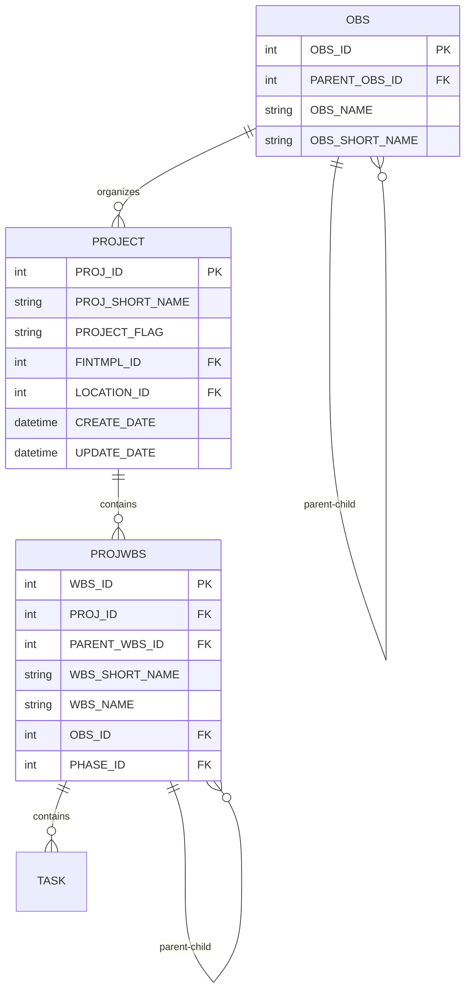
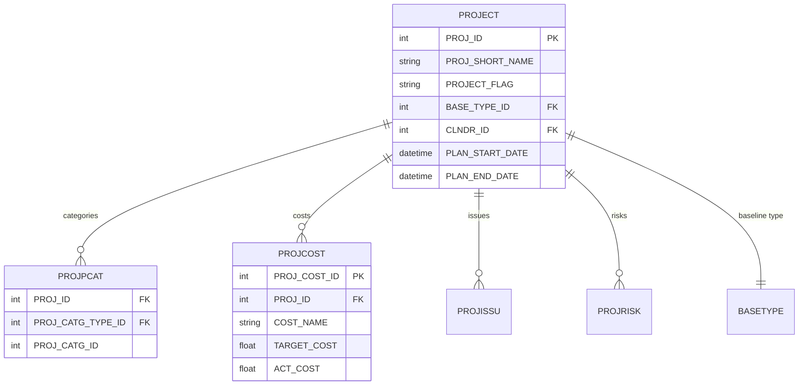
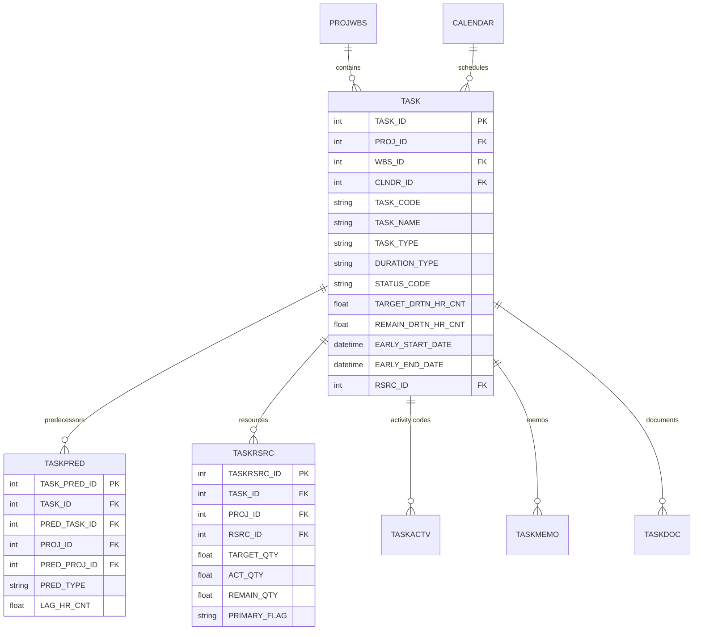
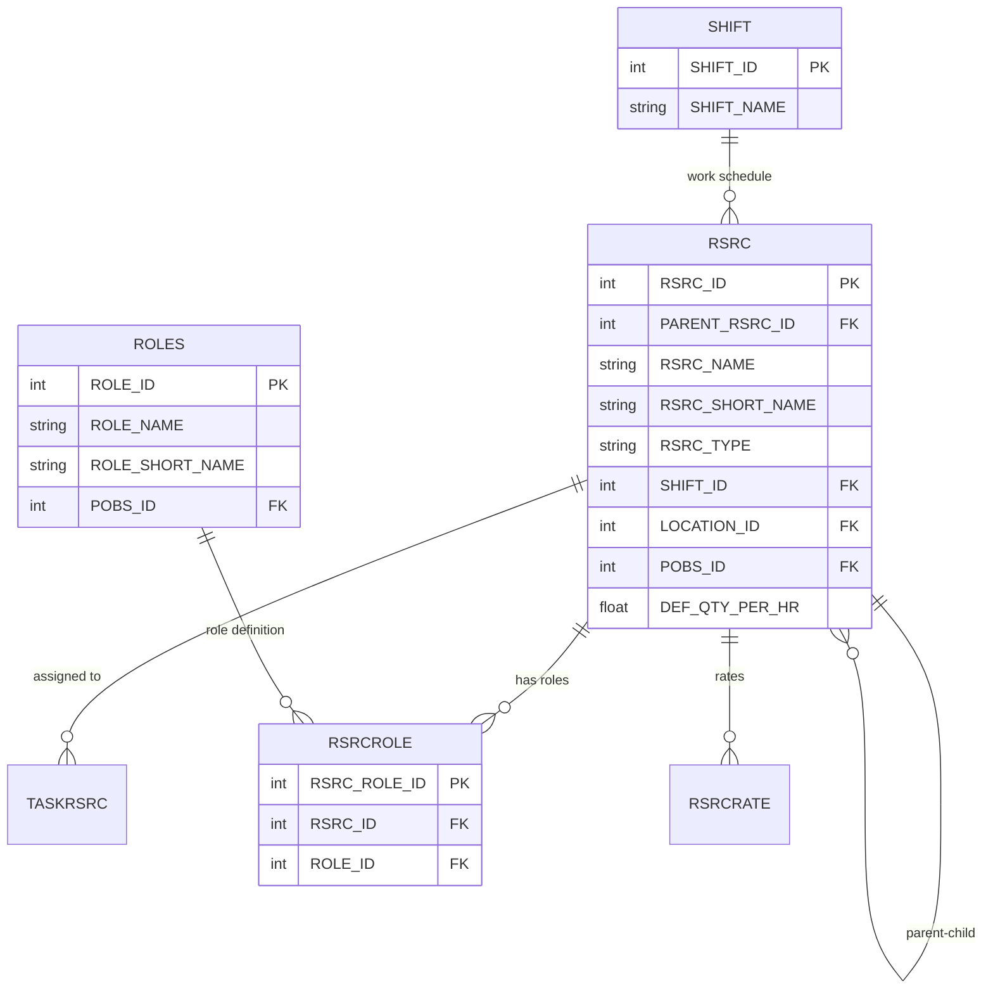
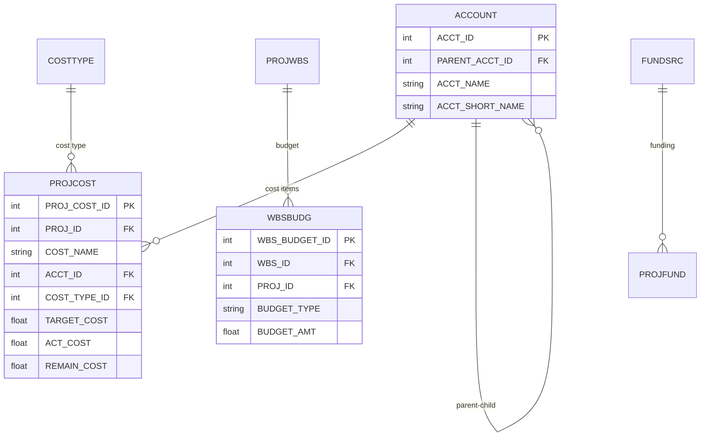
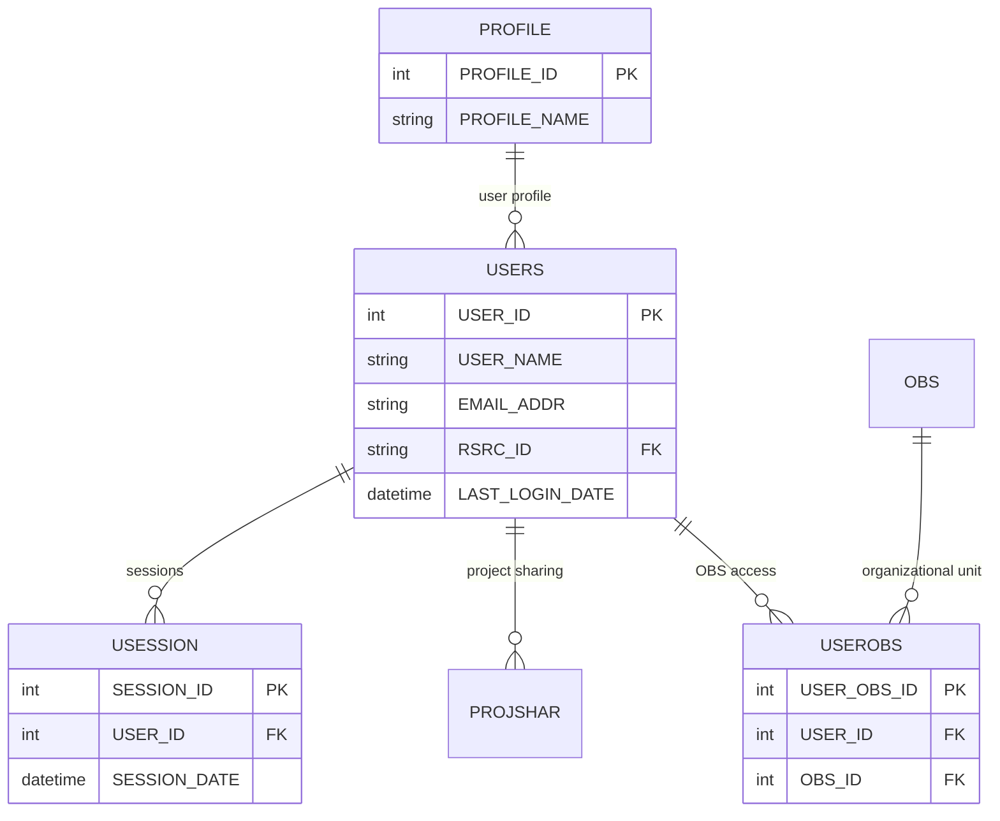
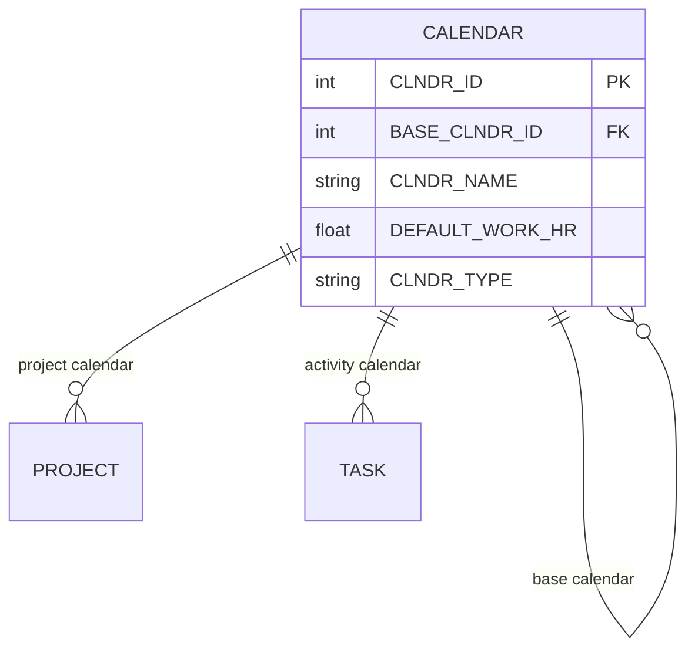
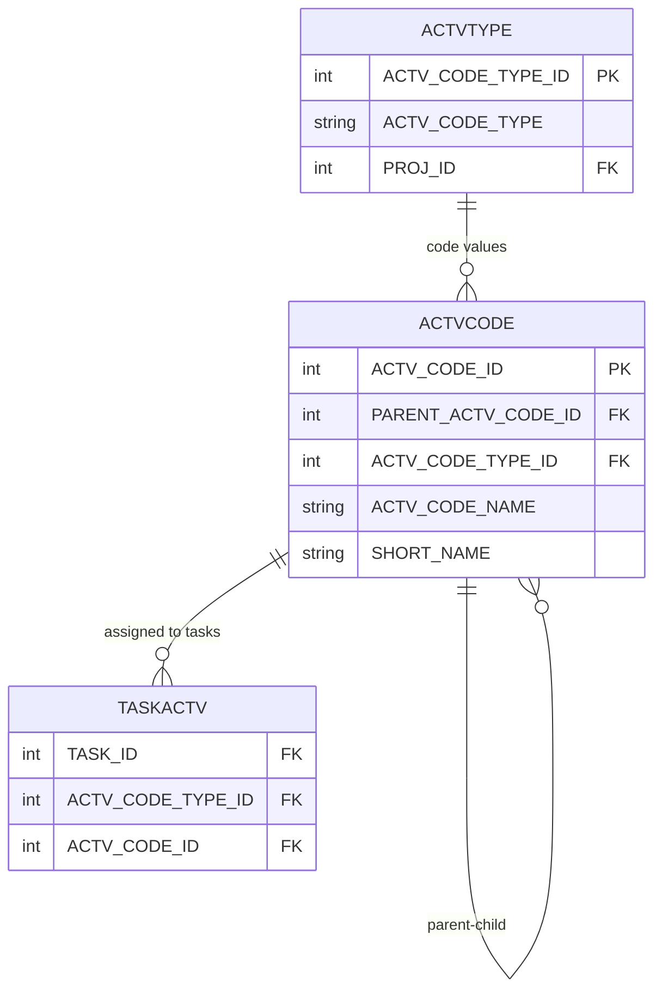
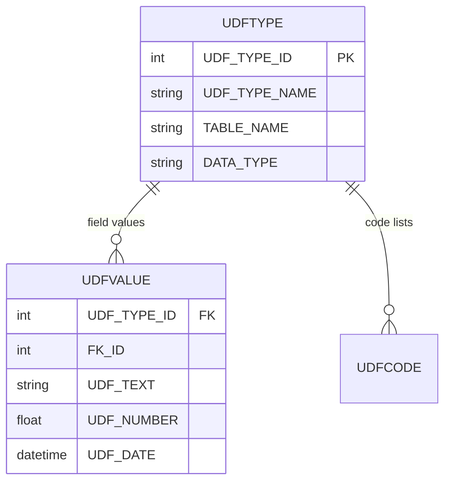
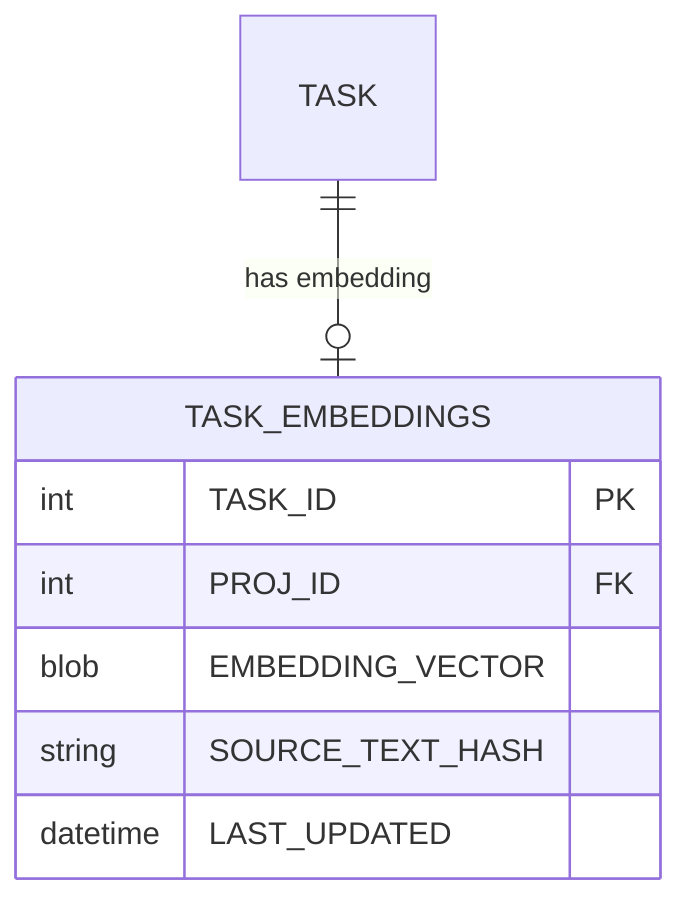

# Primavera P6 Database Schema Documentation

## Overview

This document provides a comprehensive overview of the Primavera P6 Professional SQLite database schema. The database contains **124 tables** organized into logical domains for managing projects, tasks, resources, and related entities.

---

## Table of Contents

1. [Core Entities](#core-entities)
2. [Project Structure](#project-structure)
3. [Task Management](#task-management)
4. [Resource Management](#resource-management)
5. [Financial Management](#financial-management)
6. [User & Security](#user--security)
7. [Supporting Tables](#supporting-tables)
8. [Complete Table List](#complete-table-list)

---

## Core Entities

### Project Hierarchy

The P6 database follows a hierarchical structure for organizing projects:

**Key Tables:**
- **PROJECT**: Main project container (EPS or actual projects)
- **PROJWBS**: Work Breakdown Structure - organizes project hierarchy
- **OBS**: Organizational Breakdown Structure - organizational hierarchy

---

## Project Structure

### Enterprise Project Structure (EPS)

---

## Task Management

### Tasks and Activities

**Task Relationship Types (PRED_TYPE):**
- `PR_FS` - Finish-to-Start
- `PR_SS` - Start-to-Start
- `PR_FF` - Finish-to-Finish
- `PR_SF` - Start-to-Finish

**Task Types (TASK_TYPE):**
- `TT_Task` - Normal Task
- `TT_Mile` - Milestone
- `TT_FinMile` - Finish Milestone
- `TT_Rsrc` - Resource Dependent
- `TT_LOE` - Level of Effort
- `TT_WBS` - WBS Summary

**Status Codes (STATUS_CODE):**
- `TK_NotStart` - Not Started
- `TK_Active` - In Progress
- `TK_Complete` - Completed

---

## Resource Management

### Resources and Assignments

**Resource Types (RSRC_TYPE):**
- `RT_Labor` - Labor/People
- `RT_Mat` - Material
- `RT_Equip` - Equipment
- `RT_Nonlabor` - Non-labor

---

## Financial Management

### Cost Accounts and Budgets

---

## User & Security

### Users and Access Control

---

## Supporting Tables

### Calendars

### Activity Codes

### User Defined Fields (UDF)

---

## Complete Table List

### Project & WBS (10 tables)
- **PROJECT** - Main project container
- **PROJWBS** - Work Breakdown Structure
- **PROJPCAT** - Project categories
- **PROJCOST** - Project-level costs
- **PROJISSU** - Project issues
- **PROJRISK** - Project risks
- **PROJFUND** - Project funding
- **PROJEST** - Project estimates
- **PROJTHRS** - Project thresholds
- **PROJSHAR** - Project sharing/permissions

### Task Management (12 tables)
- **TASK** - Activities/tasks
- **TASKPRED** - Task predecessors/relationships
- **TASKRSRC** - Task resource assignments
- **TASKACTV** - Task activity codes
- **TASKMEMO** - Task memos
- **TASKNOTE** - Task notes
- **TASKDOC** - Task documents
- **TASKPROC** - Task procedures
- **TASKFIN** - Task financials
- **TASKRISK** - Task risks
- **TASKFDBK** - Task feedback
- **TASK_EMBEDDINGS** - Vector embeddings for semantic search

### Resources (16 tables)
- **RSRC** - Resource master
- **RSRCROLE** - Resource roles
- **RSRCRATE** - Resource rates
- **RSRCRCAT** - Resource categories
- **RSRCCURV** - Resource curves
- **RSRCSEC** - Resource security
- **WBSRSRC** - WBS resource assignments
- **WBSRSRC_QTY** - WBS resource quantities
- **SUMTRSRC** - Summary task resources
- **TRSRCFIN** - Task resource financials
- **ROLES** - Role definitions
- **ROLERATE** - Role rates
- **ROLELIMIT** - Role limits
- **ROLECATTYPE** - Role category types
- **ROLECATVAL** - Role category values
- **RFOLIO** - Resource portfolio

### Financial (11 tables)
- **ACCOUNT** - Cost accounts
- **COSTTYPE** - Cost types
- **WBSBUDG** - WBS budgets
- **BUDGCHNG** - Budget changes
- **FUNDSRC** - Funding sources
- **CURRTYPE** - Currency types
- **FINTMPL** - Financial templates
- **FINDATES** - Financial dates
- **TASKFIN** - Task financials
- **TRSRCFIN** - Task resource financials
- **PROJFUND** - Project funding

### Codes & Categories (11 tables)
- **ACTVTYPE** - Activity code types
- **ACTVCODE** - Activity codes
- **PCATTYPE** - Project category types
- **PCATVAL** - Project category values
- **RCATTYPE** - Resource category types
- **RCATVAL** - Resource category values
- **ROLECATTYPE** - Role category types
- **ROLECATVAL** - Role category values
- **ASGNMNTCATTYPE** - Assignment category types
- **ASGNMNTCATVAL** - Assignment category values
- **ASGNMNTACAT** - Assignment categories

### Organization (6 tables)
- **OBS** - Organizational Breakdown Structure
- **POBS** - Project OBS
- **USEROBS** - User OBS assignments
- **LOCATION** - Physical locations
- **PHASE** - Project phases
- **BASETYPE** - Baseline types

### Users & Security (9 tables)
- **USERS** - User accounts
- **PROFILE** - User profiles
- **PROFPRIV** - Profile privileges
- **USERSET** - User settings
- **USESSION** - User sessions
- **PREFER** - User preferences
- **USERDATA** - User data
- **USERENG** - User engagement
- **USERCOL** - User columns

### Calendars & Time (3 tables)
- **CALENDAR** - Calendar definitions
- **SHIFT** - Work shifts
- **SHIFTPER** - Shift periods

### Documents & Communication (7 tables)
- **DOCUMENT** - Document management
- **DOCCATG** - Document categories
- **DOCSTAT** - Document status
- **DISCUSSION** - Discussions/comments
- **DISCUSSION_READ** - Discussion read status
- **MEMOTYPE** - Memo types
- **WBSMEMO** - WBS memos

### Reporting (6 tables)
- **RPT** - Reports
- **RPTBATCH** - Report batches
- **RPTGROUP** - Report groups
- **RPTLIST** - Report lists
- **FILTPROP** - Filter properties
- **VIEWPROP** - View properties

### Risk Management (3 tables)
- **RISKTYPE** - Risk types
- **PROJRISK** - Project risks
- **TASKRISK** - Task risks

### Issues & Procedures (4 tables)
- **PROJISSU** - Project issues
- **ISSUHIST** - Issue history
- **PROCGROUP** - Procedure groups
- **PROCITEM** - Procedure items

### External Integration (3 tables)
- **EXTAPP** - External applications
- **EXPPROJ** - Exported projects
- **PKXREF** - Primary key cross-reference

## AI & Vector Search

### Vector Embeddings

**Key Tables:**
- **TASK_EMBEDDINGS**: Stores vector embeddings for task descriptions and context (WBS path) to enable semantic search.

---

## Portfolios (3 tables)
- **PFOLIO** - Project portfolios
- **PRPFOLIO** - Project-portfolio links
- **RSRFOLIO** - Resource-portfolio links

### UDF (4 tables)
- **UDFTYPE** - User-defined field types
- **UDFVALUE** - User-defined field values
- **UDFCODE** - User-defined code lists
- **UMEASURE** - Units of measure

### Summary & Aggregation (4 tables)
- **SUMTASK** - Summary tasks
- **SUMTASKSPREAD** - Summary task spreads
- **SUMTRSRC** - Summary task resources
- **WBSSTEP** - WBS steps

### System & Admin (8 tables)
- **ADMIN_CONFIG** - System configuration
- **NEXTKEY** - Next available keys (ID generation)
- **SETTINGS** - Application settings
- **JOBSVC** - Job services
- **GCHANGE** - Global changes
- **FACTOR** - Calculation factors
- **FACTVAL** - Factor values
- **IMAGEDATA** - Stored images

### Deletion Tracking (7 tables)
- **DLTACCT** - Deleted accounts
- **DLTACTV** - Deleted activity codes
- **DLTOBS** - Deleted OBS
- **DLTROLE** - Deleted roles
- **DLTRSRC** - Deleted resources
- **DLTRSRL** - Deleted resource roles
- **DLTUSER** - Deleted users

### Miscellaneous (6 tables)
- **REFRDEL** - Reference deletions
- **TRAKVIEW** - Track view
- **THRSPARM** - Threshold parameters
- **PROJPROP** - Project properties
- **USERDATA** - Additional user data
- **WBRSCAT** - WBS resource categories

---

## Key Relationships Summary

### Primary Entity Relationships

1. **PROJECT → PROJWBS → TASK**
   - One project contains multiple WBS elements
   - Each WBS element contains multiple tasks

2. **TASK → TASKPRED**
   - Tasks linked via predecessor relationships
   - Supports FS, SS, FF, SF with lag

3. **TASK → TASKRSRC ← RSRC**
   - Resources assigned to tasks
   - Many-to-many relationship

4. **RSRC → RSRCROLE ← ROLES**
   - Resources have multiple roles
   - Roles defined at organizational level

5. **PROJECT/WBS → ACCOUNT → PROJCOST**
   - Cost tracking hierarchy
   - Budgets at WBS level

---

## Database Statistics

- **Total Tables**: 125
- **Core Entity Tables**: ~30
- **Supporting/Lookup Tables**: ~40
- **Category/Code Tables**: ~15
- **User/Security Tables**: ~10
- **Deletion Tracking**: 7
- **System/Admin**: ~10

---

## Notes

### ID Generation
The **NEXTKEY** table manages auto-increment IDs for all primary keys in the database.

### Soft Deletes
Most tables include `DELETE_SESSION_ID` and `DELETE_DATE` for soft deletion tracking. Deleted records are also copied to `DLT*` tables.

### Audit Fields
Standard audit fields across most tables:
- `CREATE_DATE`, `CREATE_USER`
- `UPDATE_DATE`, `UPDATE_USER`

### Foreign Key Naming
Foreign keys typically follow the pattern: `{TABLE_NAME}_ID` references `{TABLE_NAME}(ID)`

---

## Version Information

**Database Format**: SQLite  
**P6 Version**: Professional (based on schema structure)  
**Documentation Generated**: November 20, 2025

---

*This documentation was generated by analyzing the P6 SQLite database schema structure.*
