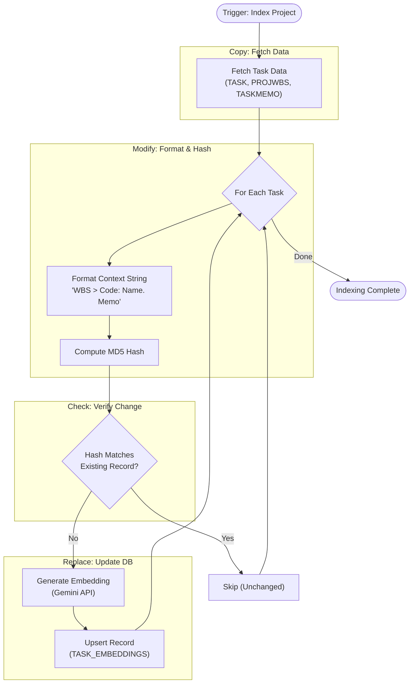
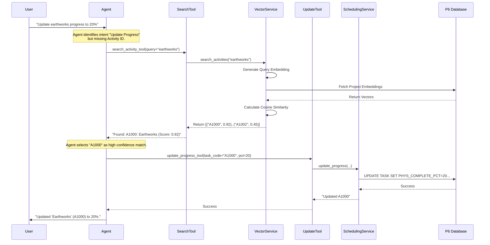

# Activity Vector Search Proposal

## 0. Context & Architecture
*   **System**: P6 Scheduling Agent (FastAPI + Pydantic AI).
*   **Goal**: Enable natural language identification of P6 activities (e.g., "Update Earthworks") without requiring exact IDs.
*   **Current Stack**: Python 3.10+, SQLite (local P6 DB), Google Gemini API.
*   **Integration**:
    *   New Service: `backend/services/vector_service.py` (handles embedding generation & search).
    *   New Tool: `backend/tools/p6_tools.py` (exposed to Agent).
    *   Config: `backend/config/settings.py` (Gemini API Key).
*   **Dependencies**: `google-generativeai`, `numpy`.

## 1. Objective
Implement a robust system to identify P6 activities using natural language descriptions via vector search. This allows the agent to find and update activities (e.g., "Update Earthworks") without requiring the user to provide the exact Activity ID (`TASK_CODE`).

## 2. Embedding Model
**Model**: `models/embedding-001` (Google Gemini)
**Dimension**: 768 floats.

## 3. Database Implementation (SQLite)

### 3.1. SQLite Vector Support Decision
We explicitly chose the **Pure Python Option** to avoid the complexity and deployment issues associated with compiling C-extensions (`sqlite-vec`, `sqlite-vss`) for SQLite.
*   **Approach**: Store vectors as BLOBs in a standard SQLite table. Fetch relevant vectors (filtered by Project ID) into memory and perform cosine similarity using `numpy`.
*   **Performance**: For a typical P6 project (1,000 - 50,000 activities), in-memory search is extremely fast (< 50ms).
*   **Compatibility**: Works with any standard SQLite installation (no extensions needed).

### 3.2. Schema Proposal
We will add a new table `TASK_EMBEDDINGS` to the P6 database. This avoids modifying the critical `TASK` table schema, preserving P6 integrity.

```sql
CREATE TABLE IF NOT EXISTS TASK_EMBEDDINGS (
    TASK_ID INTEGER PRIMARY KEY,
    PROJ_ID INTEGER NOT NULL,
    EMBEDDING_VECTOR BLOB NOT NULL,  -- 768 floats packed as binary
    SOURCE_TEXT_HASH TEXT NOT NULL,  -- Hash of (Task Name + Description) to detect changes
    LAST_UPDATED DATETIME DEFAULT CURRENT_TIMESTAMP,
    FOREIGN KEY (TASK_ID) REFERENCES TASK(TASK_ID) ON DELETE CASCADE
);

CREATE INDEX IF NOT EXISTS IDX_TASK_EMBEDDINGS_PROJ ON TASK_EMBEDDINGS(PROJ_ID);
```

## 4. Implementation Workflow

### 4.1. Vector Generation (Indexing)
A background process or "Index Project" tool will:
1.  Fetch all activities for a Project.
2.  Construct a **Rich Context Description** for each activity to enable zero-shot disambiguation:
    *   Format: `"{WBS_PATH} > {TASK_CODE}: {TASK_NAME}. {TASK_MEMO}"`
    *   *Example*: `"Phase 1 > Earthworks > A1000: Excavation. Digging foundation."`
    *   *Note: `TASK_MEMO` content comes from the `TASKMEMO` table (Notebook topics).*
3.  Compute MD5 hash of the Description.
4.  Check `TASK_EMBEDDINGS`:
    *   If `TASK_ID` exists and `SOURCE_TEXT_HASH` matches -> Skip (Up to date).
    *   Otherwise -> Generate Embedding via Gemini API -> Insert/Update DB.



### 4.2. Vector Search (Retrieval)
When the user asks: *"Update Earthworks in Phase 1 to 50%"*
1.  Agent identifies the intent is "Update Activity" but lacks `TASK_CODE`.
2.  Agent calls `search_activity_tool(query="Earthworks in Phase 1", project_id=1006)`.
3.  **Tool Logic**:
    *   Generate embedding for query "Earthworks in Phase 1".
    *   Select `TASK_ID`, `EMBEDDING_VECTOR` from `TASK_EMBEDDINGS` where `PROJ_ID = 1006`.
    *   Convert BLOBs to Numpy arrays.
    *   Calculate Cosine Similarity between Query Vector and all Task Vectors.
    *   Return top N matches (e.g., Top 3) with Similarity Score.
4.  **Agent Decision**:
    *   The WBS Path in the embedding ensures "Phase 1" activities rank higher than "Phase 2".
    *   If Top 1 score > Threshold (e.g., 0.85) -> Proceed automatically.
    *   If ambiguous (scores close) -> Ask user to confirm: *"Did you mean 'A1000: Earthworks'?"*

## 5. Data Storage Format
*   **BLOB Encoding**: Use Python's `struct` or `numpy.tobytes()` to store the 768-float vector as a raw byte string.
*   **Size**: 768 * 4 bytes (float32) = 3 KB per activity.
    *   10,000 activities = ~30 MB. (Very manageable).

## 6. Future Enhancements
*   **Hybrid Search**: Combine Vector Search with SQL `LIKE` search for exact keyword matches.
*   **Auto-Indexing**: Trigger indexing automatically when `create_activity` or `update_activity` tools are called.

## 7. Execution Flow Diagram

The following diagram illustrates the system flow for the query: *"Update the earthworks activity progress to 20%"*.


