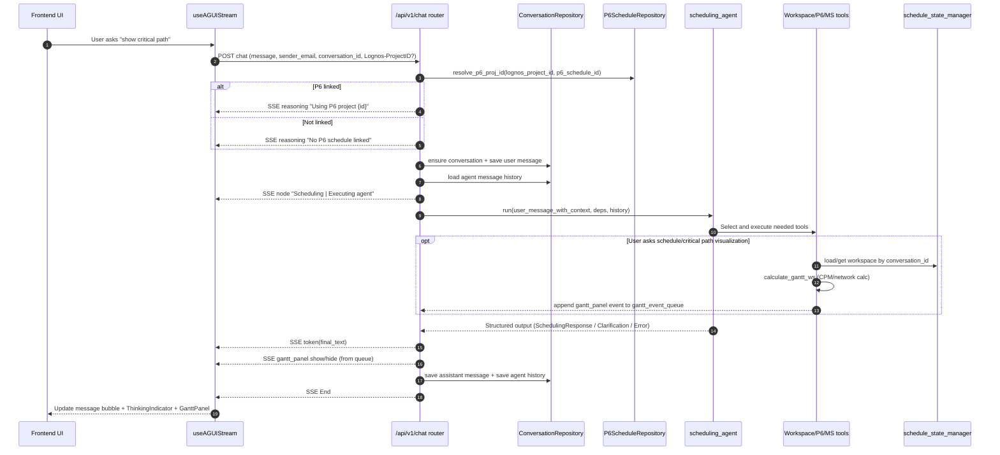

# Agentic Scheduling Flow

Brief map of how a scheduling request is processed end-to-end in this project.

## Quick answer for trace `019ca33d7d40870603950fabb2eb629d`

`"No P6 schedule linked"` is **not** an LLM-generated agent answer. It is a **backend SSE reasoning event** emitted by code in `backend/api/routers/chat.py` during initialization, before `scheduling_agent.run(...)` executes.

Source logic:
- Resolve `p6_proj_id` from `Lognos-ProjectID` (+ optional `p6_schedule_id`)
- If not found, emit reasoning event: `No P6 schedule linked`

## End-to-end processing

1. **Frontend send**: `frontend/hooks/useAGUIStream.ts` posts user text to `POST /api/v1/chat` and starts SSE parsing.
2. **Router init**: `backend/api/routers/chat.py` emits node state (`Initializing`) and reasoning text (`Using P6 project ...` or `No P6 schedule linked`).
3. **Conversation context**: backend creates/loads conversation, stores user message, loads prior `message_history`.
4. **Agent execution**: router builds `AgentDeps` and runs `scheduling_agent.run(...)` from `backend/agents/scheduling_agent.py`.
5. **Tool loop**: agent chooses tools (workspace/P6/MS) based on prompt + system instructions.
6. **Schedule calc path**: for schedule visualization/critical path, tool `calculate_gantt_ws` (`backend/tools/workspace/mutations.py`) runs CPM and pushes a Gantt panel event into `gantt_event_queue`.
7. **Stream back**: router emits token output, then emits queued Gantt events, then `End` event; also persists assistant response + message history.
8. **Frontend render**: `useAGUIStream` updates assistant text, `ThinkingIndicator` state, and `GanttPanel` visibility/data from streamed events.

## Mermaid sequence diagram

