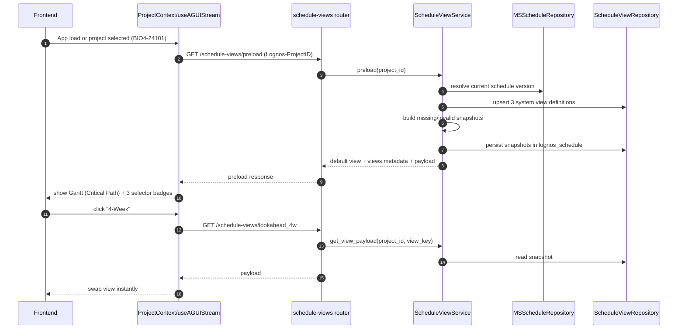

# Schedule Preload + Saved Views Proposal

## Goal

Improve first-turn UX and reduce agent/tool latency by preloading the selected project's latest schedule and exposing three ready-to-use Gantt views:

1. **Critical Path** (default)
2. **4-Week Window** (previous week + next 3 weeks, include any activity overlapping the window)
3. **Full Schedule**

Persist these view definitions in Supabase under `lognos_schedule` for future user-personalized views.

## Implementation status

- Implemented in code:
  - `backend/api/routers/schedule_views.py`
  - `backend/services/schedule_view_service.py`
  - `backend/repositories/schedule_view_repository.py`
  - Router wiring in `backend/api/main.py`
  - Frontend preload + view switch in `frontend/hooks/useAGUIStream.ts`
  - Gantt view badges in `frontend/components/gantt/GanttPanel.tsx`
  - Prop threading in `frontend/components/ChatWithHistory.tsx` and `frontend/components/ChatLayout.tsx`
  - View metadata types in `frontend/types/schedule.ts`
- Migration file created (not applied by me):
  - `backend/migrations/002_schedule_views_tables.sql`

## Current state (review summary)

### Schema verification (updated)
- Verified in Supabase project `kxwradnyjqobvdheklsn`: schedule tables are now present in `lognos_schedule` (`schedule_versions`, `schedule_activities`, `schedule_links`, `schedule_cp`, `project_calendars`, `project_constraints`, `constraint_types`, `calendar_exceptions`, `schedule_classification_rules`, `schedule_update_logs`).
- Matching schedule tables still exist in `public` at this time.
- Proposal update: treat `lognos_schedule` as the authoritative source for schedule reads/writes.

### Backend schema hardening status (verified)
- Verified in code: `backend/repositories/ms_schedule_repository.py` now uses `SCHEMA = "lognos_schedule"` and routes all schedule table access through `_table(...)` scoped to that schema.
- Result: the primary schedule repository no longer depends on default schema resolution for schedule data access.

### Frontend
- Project selection is local-state + localStorage only (`ProjectContext`), with no schedule preload trigger.
- Chat requests include `Lognos-ProjectID`, but schedule loading still depends on agent/tool decisions per prompt.
- Gantt panel currently supports relationship mode toggles but has no schedule-view selector badges.
- Gantt data is shown only when streamed from tool events (`gantt_panel`).

### Backend
- `/api/v1/chat` resolves context and emits status/reasoning events, then runs `scheduling_agent`.
- Workspace/Gantt data is generated via tools (not preloaded on project change).
- MS schedule data is now available in `lognos_schedule` and should be consumed from that schema.
- `MSScheduleRepository` is already schema-scoped to `lognos_schedule`.

### UX gap
- First user request often triggers discovery/loading behavior through agentic steps, creating avoidable wait and noisy status messages.
- The system has enough data to preload schedule context immediately when a project is selected.

## Proposed target behavior

When the app loads (or project changes):
1. Resolve selected Lognos project to latest MS schedule version (`is_current=true` fallback to highest `version_number`).
2. Preload workspace and precompute 3 view payloads server-side.
3. Return Gantt payload for **Critical Path** immediately.
4. Show view badges in Gantt subheader: `Critical Path`, `4-Week`, `Full`.
5. Switching badges uses precomputed DB-backed view payloads (no full agent/tool loop).

## Architecture changes

### 1) New backend read API for preload (non-agent path)

Add router: `backend/api/routers/schedule_views.py`

Endpoints:
- `GET /api/v1/schedule-views/preload`
  - Input: header `Lognos-ProjectID`
  - Behavior:
    - Resolve active schedule version for selected project
    - Ensure 3 system views exist / are up to date
    - Return `active_version`, `default_view`, and `views[]`
- `GET /api/v1/schedule-views/{view_key}`
  - Input: header `Lognos-ProjectID`
  - Return serialized gantt payload for that view

Notes:
- Keep router thin (auth + validation), delegate to service.
- No direct DB in router.

### 2) New service layer

Add `backend/services/schedule_view_service.py`:
- `resolve_current_version(project_id)`
- `ensure_system_views(project_id, version_id)`
- `build_view_payload(view_type, version_id, reference_date)`
- `get_view_payload(project_id, view_key)`

Implementation detail:
- Reuse existing schedule calculation/filter logic where possible (avoid duplicating CPM logic).
- For `4-week` window, overlap condition must be:
  - `activity.finish >= window_start` and `activity.start <= window_end`

### 3) Repository additions

Add `backend/repositories/schedule_view_repository.py` for `lognos_schedule` schema access:
- CRUD for view definitions and cached payload snapshots
- Version invalidation helpers

Keep `MSScheduleRepository` schema-scoped to `lognos_schedule` (already implemented) and apply the same explicit schema pattern to any new schedule-view repository.

### 4) Frontend preload + selector badges

Changes:
- `ProjectContext` or `useAGUIStream`: on `currentProject` change, call `GET /api/v1/schedule-views/preload`.
- Add local state: `scheduleViews`, `activeViewKey`, `isPreloading`.
- `GanttPanel` subheader: clickable badges:
  - `Critical Path`
  - `4-Week`
  - `Full`
- On badge click:
  - If payload already in memory, swap instantly.
  - Else fetch `/api/v1/schedule-views/{view_key}` and cache in hook state.

Important:
- This is view switching, not agent prompting.
- Agent remains available for conversational edits/analysis.

## Database design (`lognos_schedule`, project `kxwradnyjqobvdheklsn`)

### Existing schedule source tables (already migrated)
- `lognos_schedule.schedule_versions`
- `lognos_schedule.schedule_activities`
- `lognos_schedule.schedule_links`
- `lognos_schedule.schedule_cp`
- `lognos_schedule.project_calendars`
- `lognos_schedule.project_constraints`
- `lognos_schedule.constraint_types`
- `lognos_schedule.calendar_exceptions`
- `lognos_schedule.schedule_classification_rules`
- `lognos_schedule.schedule_update_logs`

These are now the baseline source tables for preload and view generation.

### New tables

#### `lognos_schedule.schedule_view_definitions`
- `id uuid pk default gen_random_uuid()`
- `project_id text not null`
- `schedule_version_id bigint not null`
- `view_key text not null`  
  - system keys: `critical_path`, `lookahead_4w`, `full_schedule`
- `view_name text not null`
- `view_type text not null`  
  - `system` | `user`
- `is_default boolean not null default false`
- `config jsonb not null`  
  - filters/grouping/date window/reference mode
- `created_by text null`
- `created_at timestamptz default now()`
- `updated_at timestamptz default now()`

Constraints:
- unique `(project_id, schedule_version_id, view_key)`
- check `view_key` for system keys when `view_type='system'`

Indexes:
- `(project_id, schedule_version_id)`
- partial index on `(project_id, is_default)`

#### `lognos_schedule.schedule_view_snapshots`
- `id uuid pk default gen_random_uuid()`
- `view_definition_id uuid not null references schedule_view_definitions(id) on delete cascade`
- `schedule_version_id bigint not null`
- `payload jsonb not null`  
  - exactly `GanttChartData` contract used by frontend
- `computed_at timestamptz default now()`
- `checksum text null`

Indexes:
- `(view_definition_id, computed_at desc)`
- `(schedule_version_id)`

### Why snapshots
- Fast view switching
- Zero tool/agent latency for standard view transitions
- Stable UX across refreshes

## Data flow diagram

## Proposed API contracts

### `GET /api/v1/schedule-views/preload`
Response:
- `project_id`
- `schedule_version_id`
- `default_view_key` (`critical_path`)
- `views`: `[ { view_key, view_name, view_type, is_default, computed_at } ]`
- `payload`: `GanttChartData` for default view

### `GET /api/v1/schedule-views/{view_key}`
Response:
- `view_key`
- `schedule_version_id`
- `computed_at`
- `payload`: `GanttChartData`

## UI changes (minimal)

### Gantt subheader badges
Add to `GanttPanel` subheader area:
- Badge group with 3 fixed options.
- Active badge styling consistent with existing dark theme tokens.
- Keep existing relationship mode toggle unchanged.

### Suggested interaction rules
- Default selected: `Critical Path`.
- If preload fails, keep chat usable and show non-blocking fallback notice.
- No modal/no extra panel.

## Caching + invalidation strategy

Invalidate snapshots when:
- `schedule_version_id` changes for project
- a new upload/promote marks a new `is_current`
- user saves workspace into a new subversion and promotes it

TTL (optional):
- 6 hours for system views, with lazy refresh on first read.

## Rollout plan

1. **DB extension**: create `schedule_view_definitions` + `schedule_view_snapshots` in `lognos_schedule`.
2. **Backend API**: add repository, service, and router endpoints.
3. **Frontend**: preload on project select + badge selector in Gantt subheader.
4. **Optimization**: only call agent when user asks analytical questions/actions, not for static view switches.
5. **Future**: add user-personalized saved views (`view_type='user'`, `created_by`).

## Acceptance criteria

- Selecting project `BIO4-24101` preloads latest current version without user prompt.
- On first open, Gantt is visible in `Critical Path` view by default.
- Badge switch among `Critical Path`, `4-Week`, `Full` completes without agent run.
- View definitions and snapshots persist in `lognos_schedule`.
- Existing conversational/agent workflows remain functional.

## Risks and mitigations

- **Risk**: duplicated schedule tables in `public` and `lognos_schedule` cause inconsistent reads.
  - **Mitigation**: force schema-qualified repository access (`lognos_schedule`) and plan cleanup/deprecation of `public` duplicates.
- **Risk**: duplicate CPM logic across tools and service.
  - **Mitigation**: centralize shared computation helper in service module reused by both agent tools and preload service.
- **Risk**: stale snapshots after version promotion.
  - **Mitigation**: invalidate by `(project_id, schedule_version_id)` on promote/upload events.
- **Risk**: large payload sizes for full schedule.
  - **Mitigation**: gzip transport + optional pagination/virtualized payload optimization later.
