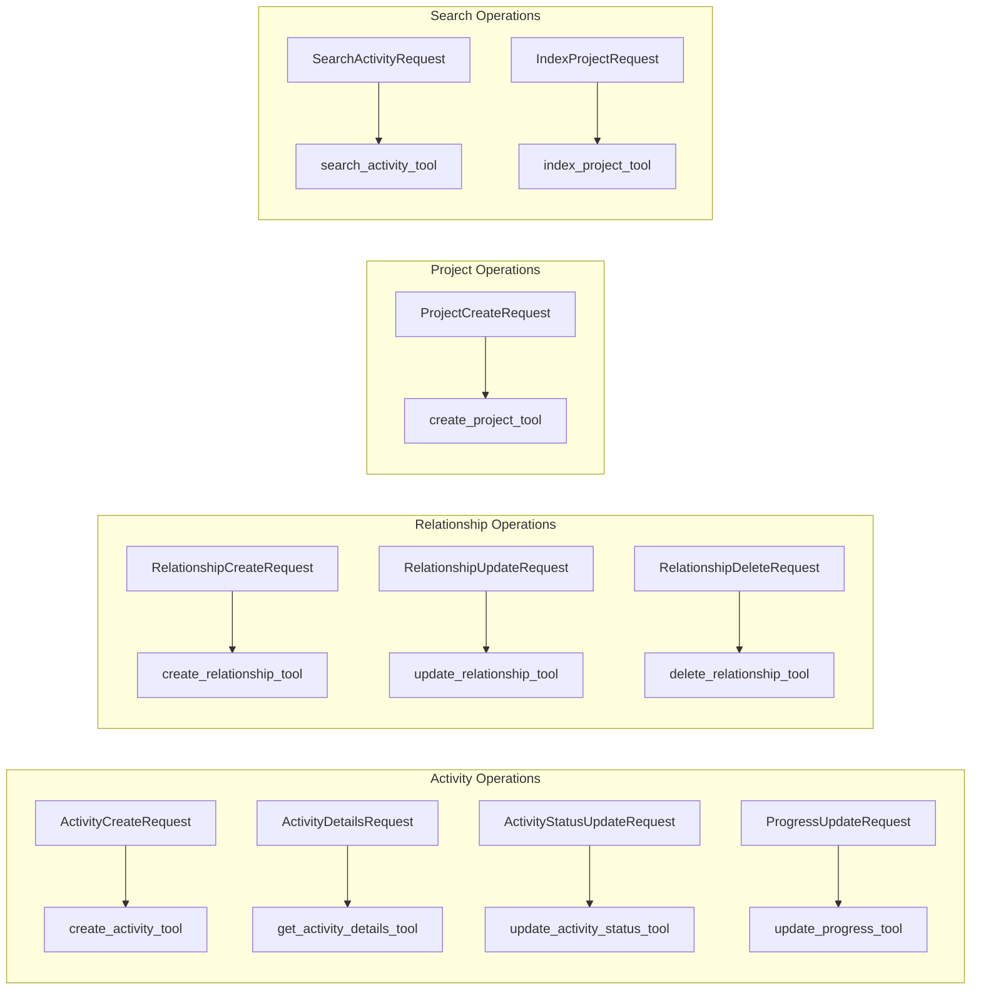

# Scheduling Tools Documentation

This document describes the Pydantic AI tools available for the P6 Scheduling Agent. These tools enable the agent to perform CRUD operations on the Primavera P6 schedule database.

---

## Table of Contents

1. [Overview](#overview)
2. [Tool Categories](#tool-categories)
3. [Activity Tools](#activity-tools)
4. [Relationship Tools](#relationship-tools)
5. [Project Tools](#project-tools)
6. [Search Tools](#search-tools)
7. [Data Models](#data-models)
8. [Usage Patterns](#usage-patterns)

---

## Overview

The scheduling tools are implemented as Pydantic AI tool functions that the agent can invoke automatically based on user intent. Each tool:

- Is decorated with `@logfire.instrument` for observability
- Accepts a `RunContext[AgentDeps]` for dependency injection
- Uses strictly-typed Pydantic request models
- Returns string responses (success messages or error details)

### Dependencies

```python
class AgentDeps:
    service: SchedulingService      # Core scheduling operations
    vector_service: VectorService   # Semantic search capabilities
    conn: sqlite3.Connection        # Database connection
```

---

## Tool Categories

| Category | Tools | Purpose |
|----------|-------|---------|
| **Activity** | `create_activity_tool`, `get_activity_details_tool`, `update_activity_status_tool`, `update_progress_tool` | CRUD operations on activities |
| **Relationship** | `create_relationship_tool`, `update_relationship_tool`, `delete_relationship_tool` | Manage predecessor/successor links |
| **Project** | `create_project_tool`, `list_projects_tool` | Create and list projects |
| **Search** | `search_activity_tool`, `index_project_tool` | Semantic search via vector embeddings |

---

## Activity Tools

### create_activity_tool

Creates a new activity in the P6 schedule.

**Request Model: `ActivityCreateRequest`**

| Field | Type | Required | Description |
|-------|------|----------|-------------|
| `task_code` | `str` | Yes | Activity Code (e.g., 'A1000'). This is the user-facing ID. |
| `task_name` | `str` | Yes | Description of the activity |
| `wbs_id` | `int` | Yes | WBS ID where the activity belongs |
| `proj_id` | `int` | Yes | Project ID |
| `planned_duration` | `float` | No | Planned duration in hours (default: 8.0) |
| `clndr_id` | `int` | No | Calendar ID (defaults to project calendar) |

**Returns:** `"Successfully created activity {task_code} with ID {task_id}."`

**Example:**
```python
req = ActivityCreateRequest(
    task_code="A1050",
    task_name="Install Foundation Rebar",
    wbs_id=1234,
    proj_id=1,
    planned_duration=16.0
)
```

---

### get_activity_details_tool

Retrieves current details for an activity including status, dates, and progress.

**Request Model: `ActivityDetailsRequest`**

| Field | Type | Required | Description |
|-------|------|----------|-------------|
| `task_code` | `str` | Yes | Activity Code |
| `proj_id` | `int` | Yes | Project ID |

**Returns:** Dictionary with:
- `status_code` - Current status (TK_NotStart, TK_Active, TK_Complete)
- `phys_complete_pct` - Physical % complete
- `act_start_date` - Actual start date
- `act_end_date` - Actual finish date
- `target_start_date` - Planned start date
- `target_end_date` - Planned finish date

---

### update_activity_status_tool

Updates the status of an activity with strict validation rules.

**Request Model: `ActivityStatusUpdateRequest`**

| Field | Type | Required | Description |
|-------|------|----------|-------------|
| `task_code` | `str` | Yes | Activity Code |
| `proj_id` | `int` | Yes | Project ID |
| `new_status` | `Literal["Not Started", "In Progress", "Completed"]` | Yes | Target status |
| `actual_start_date` | `datetime` | Conditional | Required for "In Progress" or "Completed" |
| `actual_finish_date` | `datetime` | Conditional | Required for "Completed" |
| `phys_complete_pct` | `float` | No | Optional progress update (0-100) |

**Status Transition Rules:**

```
Not Started → In Progress (requires actual_start_date)
Not Started → Completed (requires actual_start_date AND actual_finish_date)
In Progress → Completed (requires actual_finish_date)
In Progress → Not Started (clears actuals)
Completed → In Progress (clears actual_finish_date)
Completed → Not Started (clears all actuals)
```

**Automatic Behaviors:**
- Setting "Completed" automatically sets `phys_complete_pct = 100`
- Setting "Not Started" automatically sets `phys_complete_pct = 0`

---

### update_progress_tool

Updates the physical % complete of an activity.

**Request Model: `ProgressUpdateRequest`**

| Field | Type | Required | Description |
|-------|------|----------|-------------|
| `task_code` | `str` | Yes | Activity Code |
| `proj_id` | `int` | Yes | Project ID |
| `phys_complete_pct` | `float` | Yes | Physical % Complete (0.0 - 100.0) |
| `actual_start` | `datetime` | No | Actual Start Date |
| `actual_finish` | `datetime` | No | Actual Finish Date (if 100%) |

**Validation:**
- `phys_complete_pct` must be between 0 and 100
- If 100%, an `actual_finish` date is typically expected
- If > 0%, activity should have started (status becomes TK_Active)

---

## Relationship Tools

### create_relationship_tool

Creates a predecessor/successor relationship between two activities.

**Request Model: `RelationshipCreateRequest`**

| Field | Type | Required | Description |
|-------|------|----------|-------------|
| `pred_task_code` | `str` | Yes | Predecessor Activity Code |
| `succ_task_code` | `str` | Yes | Successor Activity Code |
| `proj_id` | `int` | Yes | Project ID |
| `pred_type` | `Literal["PR_FS", "PR_SS", "PR_FF", "PR_SF"]` | No | Relationship type (default: PR_FS) |
| `lag` | `float` | No | Lag in hours (default: 0.0) |

**Relationship Types:**

| Code | Name | Description |
|------|------|-------------|
| `PR_FS` | Finish-to-Start | Successor starts after predecessor finishes |
| `PR_SS` | Start-to-Start | Both activities start together |
| `PR_FF` | Finish-to-Finish | Both activities finish together |
| `PR_SF` | Start-to-Finish | Successor finishes when predecessor starts |

**Returns:** `"Successfully linked {pred_task_code} -> {succ_task_code} ({pred_type})."`

**Example:**
```python
req = RelationshipCreateRequest(
    pred_task_code="A1000",
    succ_task_code="A1010",
    proj_id=1,
    pred_type="PR_FS",
    lag=8.0  # 1 day lag (8 hours)
)
```

---

### update_relationship_tool

Updates an existing relationship's lag or type.

**Request Model: `RelationshipUpdateRequest`**

| Field | Type | Required | Description |
|-------|------|----------|-------------|
| `pred_task_code` | `str` | Yes | Predecessor Activity Code |
| `succ_task_code` | `str` | Yes | Successor Activity Code |
| `proj_id` | `int` | Yes | Project ID |
| `new_lag` | `float` | No | New lag in hours |
| `new_type` | `Literal["PR_FS", "PR_SS", "PR_FF", "PR_SF"]` | No | New relationship type |

**Note:** At least one of `new_lag` or `new_type` should be provided.

---

### delete_relationship_tool

Deletes an existing relationship between two activities.

**Request Model: `RelationshipDeleteRequest`**

| Field | Type | Required | Description |
|-------|------|----------|-------------|
| `pred_task_code` | `str` | Yes | Predecessor Activity Code |
| `succ_task_code` | `str` | Yes | Successor Activity Code |
| `proj_id` | `int` | Yes | Project ID |

---

## Project Tools

### create_project_tool

Creates a new project in the P6 database.

**Request Model: `ProjectCreateRequest`**

| Field | Type | Required | Description |
|-------|------|----------|-------------|
| `project_short_name` | `str` | Yes | Unique Project Short Name (e.g., 'PROJ-001') |
| `project_name` | `str` | Yes | Full Project Name |
| `planned_start_date` | `datetime` | No | Planned Start Date |

**Returns:** `"Successfully created project '{project_short_name}' with ID {proj_id}. Root WBS ID is {wbs_id}."`

**Note:** Creating a project automatically creates a root WBS element.

---

### list_projects_tool

Lists all projects in the P6 database with summary information including descriptions.

**Request Model: `ListProjectsRequest`**

| Field | Type | Required | Default | Description |
|-------|------|----------|---------|-------------|
| `include_eps_nodes` | `bool` | No | `False` | Include EPS hierarchy nodes |

**Returns:** Formatted table with:
- Project ID (internal reference for other operations)
- Short Name (user-facing project code)
- Project Name (full name from root WBS)
- Plan Start/End dates
- Activity count
- Description (from "Description" notebook topic, if exists)

**Example Response:**
```
Available Projects:

PROJ_ID    Short Name      Project Name                        Plan Start   Plan End     Activities Description
----------------------------------------------------------------------------------------------------------------------------------
1011       PROJ-PHX        Phoenix Tower Construction          2025-12-07   2026-04-26   500        This is a test project, and...

Total: 1 project(s)
```

**Notes:**
- Descriptions are extracted from the P6 "Description" notebook topic (stored in WBSMEMO table)
- Long descriptions are truncated with `...`
- Projects without descriptions show `-`

---

## Search Tools

### search_activity_tool

Searches for activities using natural language via vector embeddings.

**Request Model: `SearchActivityRequest`**

| Field | Type | Required | Description |
|-------|------|----------|-------------|
| `query` | `str` | Yes | Natural language query (e.g., "foundation work") |
| `proj_id` | `int` | Yes | Project ID to search within |

**Returns:** Formatted list of matching activities with similarity scores:
```
Found matching activities:
- A1000: Pour Foundation (Score: 0.92)
- A1010: Foundation Curing (Score: 0.85)
- A1020: Foundation Inspection (Score: 0.78)
```

**Threshold:** Only activities with similarity score >= 0.5 are returned.

---

### index_project_tool

Indexes a project for vector search by generating embeddings for all activities.

**Request Model: `IndexProjectRequest`**

| Field | Type | Required | Description |
|-------|------|----------|-------------|
| `proj_id` | `int` | Yes | Project ID to index |

**Returns:** `"Successfully indexed project {proj_id}."`

**Note:** This should be called:
- After bulk importing activities
- When embeddings are out of date
- Before first-time semantic search on a project

---

## Data Models

### Input/Output Summary



### Status Code Mapping

| User-Friendly | P6 Database Code | Description |
|---------------|------------------|-------------|
| Not Started | `TK_NotStart` | Activity has not begun |
| In Progress | `TK_Active` | Activity is in progress |
| Completed | `TK_Complete` | Activity is finished |

---

## Usage Patterns

### Pattern 1: Create Activity with Predecessor

```python
# 1. Create the new activity
await create_activity_tool(ctx, ActivityCreateRequest(
    task_code="A1020",
    task_name="Foundation Inspection",
    wbs_id=100,
    proj_id=1,
    planned_duration=4.0
))

# 2. Link it to predecessor
await create_relationship_tool(ctx, RelationshipCreateRequest(
    pred_task_code="A1010",  # Foundation Curing
    succ_task_code="A1020",  # Foundation Inspection
    proj_id=1,
    pred_type="PR_FS",
    lag=0.0
))
```

### Pattern 2: Search and Update Progress

```python
# 1. Search for activity by description
results = await search_activity_tool(ctx, SearchActivityRequest(
    query="concrete pour zone 3",
    proj_id=1
))
# Returns: A1015: Concrete Pour Zone 3 (Score: 0.94)

# 2. Update progress
await update_progress_tool(ctx, ProgressUpdateRequest(
    task_code="A1015",
    proj_id=1,
    phys_complete_pct=75.0
))
```

### Pattern 3: Complete an Activity

```python
# Option A: Using update_activity_status_tool (recommended)
await update_activity_status_tool(ctx, ActivityStatusUpdateRequest(
    task_code="A1000",
    proj_id=1,
    new_status="Completed",
    actual_start_date=datetime(2025, 1, 15),
    actual_finish_date=datetime(2025, 1, 20)
))

# Option B: Using update_progress_tool
await update_progress_tool(ctx, ProgressUpdateRequest(
    task_code="A1000",
    proj_id=1,
    phys_complete_pct=100.0,
    actual_finish=datetime(2025, 1, 20)
))
```

### Pattern 4: Modify Relationship Lag

```python
# Change lag from 0 to 2 days (16 hours)
await update_relationship_tool(ctx, RelationshipUpdateRequest(
    pred_task_code="A1000",
    succ_task_code="A1010",
    proj_id=1,
    new_lag=16.0  # 2 days * 8 hours/day
))
```

---

## Error Handling

All tools follow a consistent error handling pattern:

```python
try:
    result = ctx.deps.service.operation(req, conn=ctx.deps.conn)
    return success_message
except Exception as e:
    logfire.error("Error in {tool_name}", error=str(e))
    return f"Error {operation}: {str(e)}"
```

Common error scenarios:
- **Activity not found**: Invalid `task_code` for the given `proj_id`
- **Duplicate relationship**: Relationship already exists between activities
- **Invalid status transition**: E.g., completing without actual dates
- **Missing WBS**: Invalid `wbs_id` provided
- **Vector service unavailable**: For search tools when embeddings not configured

---

## Observability

All tools are instrumented with Logfire for tracing:

```python
@logfire.instrument("create_activity_tool")
async def create_activity_tool(ctx: RunContext[AgentDeps], req: ActivityCreateRequest) -> str:
    # ... tool implementation
```

This provides:
- Automatic span creation for each tool invocation
- Request parameters logged
- Error tracking with full context
- Duration metrics

---

## Version Information

**Module**: `backend/tools/p6_tools.py`  
**Dependencies**: `pydantic_ai`, `logfire`  
**Documentation Updated**: December 2, 2025

---

*This documentation describes the Pydantic AI tools for the P6 Scheduling Agent.*
