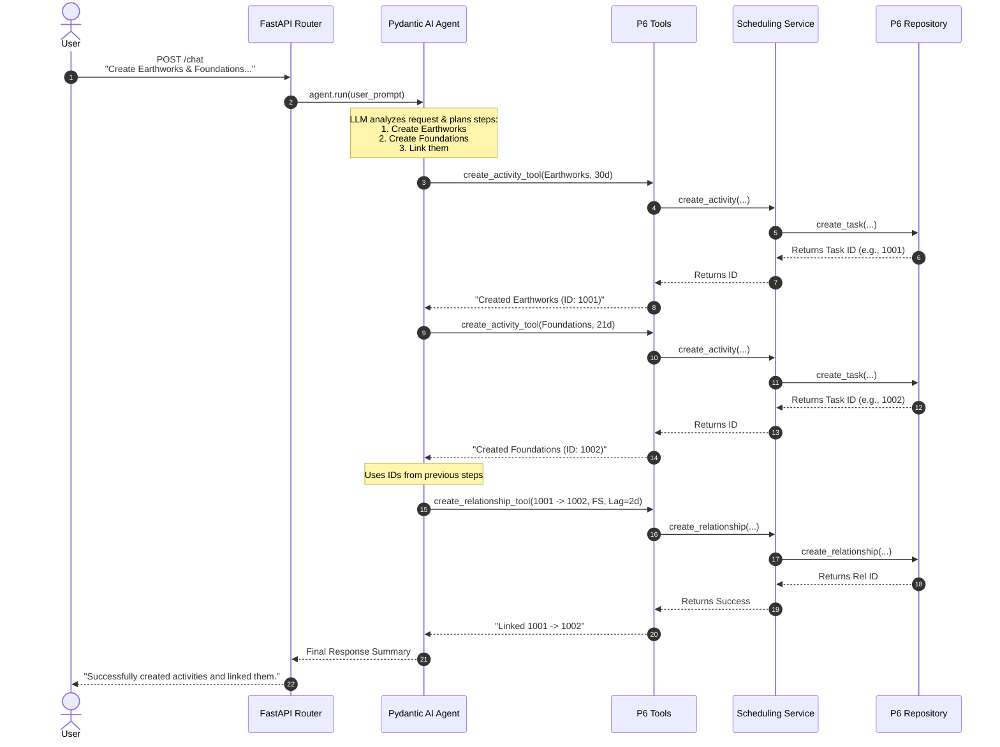
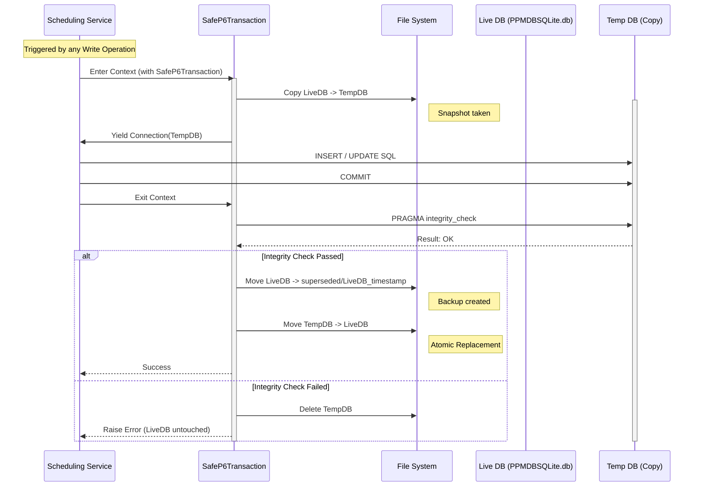

# P6 Assistant Workflow Documentation

This document illustrates how the P6 Assistant processes a complex user request involving multiple steps and how it ensures database integrity during write operations.

## Scenario
**User Request:** "Create two activities, earthworks (30 days duration) and foundations of a generator (21 days duration), with a FS relationship and a lag of 2 days."

## 1. System Architecture Workflow
This diagram shows the flow of control from the user's request through the Agent, Tools, Service, and Repository layers.

## 2. Safe Database Transaction Workflow
This diagram details the **Copy-Modify-Check-Replace** safety mechanism that occurs *inside* the `Scheduling Service` whenever a write operation (like `create_activity` or `create_relationship`) is performed. This ensures the live P6 database is never corrupted by concurrent access or script errors.

