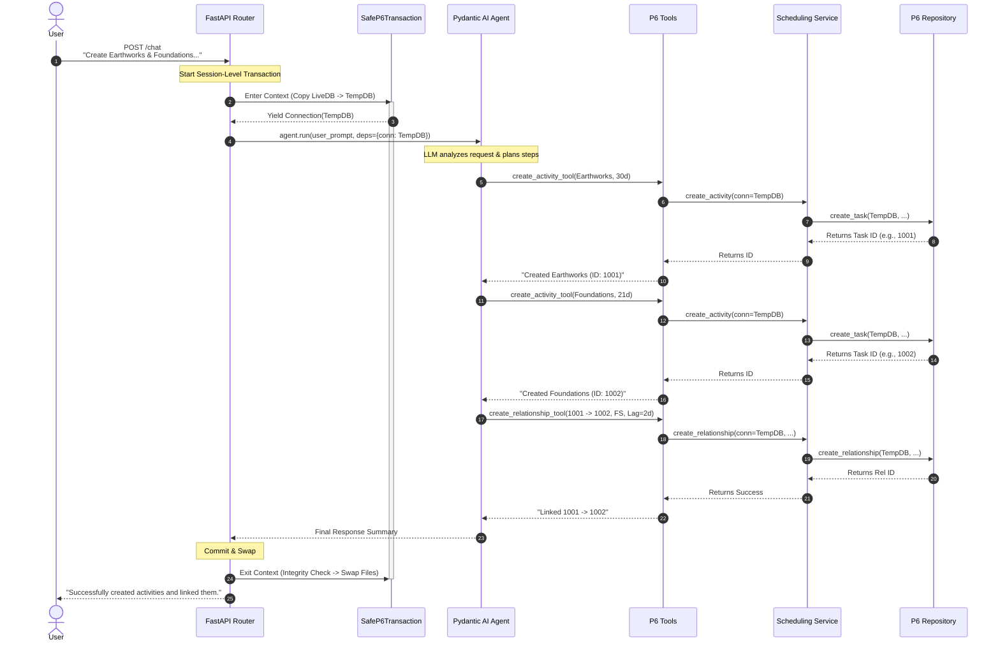
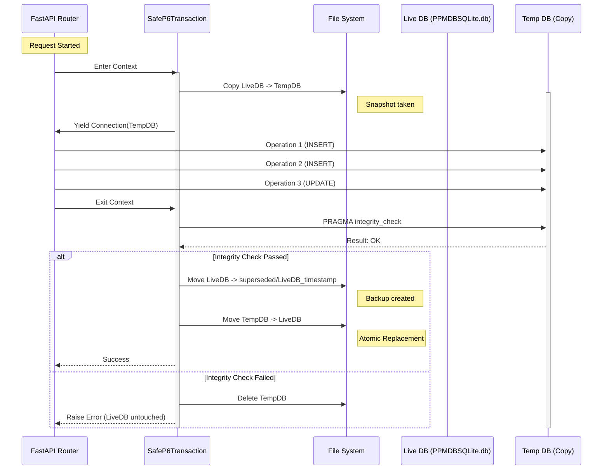

# P6 Assistant Workflow Documentation

This document illustrates how the P6 Assistant processes a complex user request involving multiple steps and how it ensures database integrity during write operations.

## Scenario
**User Request:** "Create two activities, earthworks (30 days duration) and foundations of a generator (21 days duration), with a FS relationship and a lag of 2 days."

## 1. System Architecture Workflow (Session-Level Transaction)
This diagram shows the flow of control from the user's request through the Agent, Tools, Service, and Repository layers. 
**Optimization:** The entire agent execution is wrapped in a single `SafeP6Transaction`. This means the database is copied once at the start of the request, all agent operations (multiple tool calls) are performed on the temporary copy, and the file is swapped back only once at the end of the request.

## 2. Safe Database Transaction Workflow
This diagram details the **Copy-Modify-Check-Replace** safety mechanism. In the optimized workflow, this entire sequence happens once per **Request** (Session), rather than once per individual write operation.

### Performance Note
By lifting the transaction scope to the Session (Request) level, we reduce the I/O overhead from $O(N)$ copies (where N is the number of tool calls) to $O(1)$ copy per request. This significantly improves performance for complex multi-step instructions while maintaining the same level of safety against corruption.
